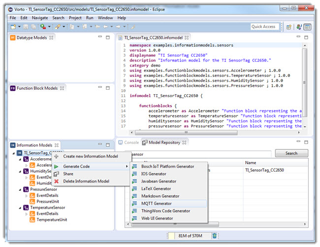

# Consume and visualize device data from an Information Model

## Prerequisites:

You have successfully installed the [Vorto Eclipse Plugins](https://marketplace.eclipse.org/content/vorto-toolset) from Eclipse Marketplace.

## Overview

In this tutorial, we are going to show you, how easy you can create a small web application that is able to receive sensor data from MQTT and visualize it in a simple HTML page.
All we need to do, is to describe the sensors with Vorto and use existing generators that convert the descriptions into multiple system components.

- MQTT consumer that receives the device data and deserializes it into a device specific object model
- Web Application Front-end that pushes the device data via Web Sockets to the browser and displays it in a HTML page.

The webapplication that is going to communicate with mqtt client will appear as shown below:

### Let's begin!

## Step 1: Implement MQTT client for functionblocks ##

1. From eclipse, switch to Vorto perspective.
2. Select Model Repository tab, Search for the info model **TI_Sensor**
3. _TI_SensorTag_ info model gets listed in the search result.
4. Drag and drop this infomodel into the infomodel frame
	
5. Select the info model -> Right-click  -> Generate Code -> _choose_ MQTT Generator
	
6. Switch back to java perspective. The generated project will not compile, since it requires some Java model classes for the device.
7. Switch back to the Vorto Repository and Generate also the _Javabeans_ for the TI SensorTag
8. Update mqtt and javabeans project. The MQTT Client project should fully compile now.

	 Congratulations! You have just generated a MQTT client for the functionblocks, offered as functionality by the TI SensorTag.

## Step 2:  Implement a Web Application for the information model   ##

In this exercise we are making our IoT app a little more sophisticated and display the MQTT sensor data in web UI Elements.

1. Switch to the Vorto Perspective and find the TI SensorTag information model.
2. Right-click and choose _Web UI Generator_ from the list of Generators
3. Switch back to the Java Perspective. You should see another Eclipse Project added by the Web UI Generator (_webdevice.example_)
4. Convert this Project to an Eclipse Project as well. The Web application is a Spring Boot application and already fully runnable.Run the application.

	
5. Open your browser under [http://localhost:8080/webdevice]
6. In the web application, switch to the Accelerometer tab. You will see status fields that have been generated from the Accelerometer functionblock.

	

	 Congratulations! You just implemented a small AngularJS web application with the help of Vorto. However the Accelerometer UI fields are not yet populated with the sensor data. Let's do that in the next exercise.

## Step 3: Sign up for a PubNub account ##

1. You’ll need to [sign up for a PubNub account](https://www.pubnub.com/get-started/#).Once you sign up, you can get your unique PubNub keys in the [PubNub Developer Portal](https://admin.pubnub.com/#/user). You will use those same keys when you want to leverage our MQTT gateway.
2. Take note of the Publish and Subscribe keys generated under Demo Keyset screen of PubNub.

## Step 4:  Receive MQTT status events and bind it to the Web UI Elements ##

In this exercise we are going to glue the Web application together with the MQTT client, that Vorto had so nicely generated for us.

1. In the pom.xml of the web application, add a dependency to the generated MQTT client
	

2. Go to the Spring Boot Application class and import the MQTT configuration for the Accelerometer (_@Import (MqttConfigurationAccelerometer.class_)).
3. Find the commented code that handles the incoming MQTT events and un-comment it.
4. Remove the annotation _@EnableScheduling_
	
5. Edit **MqttConfigurationAccelerometer.java** by adding the following lines to **inboundAccelerometer** method

	   MqttPahoMessageDrivenChannelAdapter adapter = new MqttPahoMessageDrivenChannelAdapter(this.connectionUrl, "pub-c-xxxx/sub-c-xxxx/clientAccelerometer_00c740db-9245-4e5a-8c80-8a50908ee69f");
       adapter.addTopic(this.topicName);

6. The MQTT configuration of the Accelerometer requires the MQTT topic and connection url in order to receive status events properly. Therefore we must add the following configuration to the **application.yml** file

	    	server:
      	port: 8080
      	contextPath: /webdevice
    	publish_key  : "pub-c-xxxx"
    	subscribe_key : "sub-c-xxxx"
       	mqtt:
      	connectionUrl: tcp://mqtt.pubnub.com
      	topic:
    	accelerometer: pub-c-xxxx/sub-c-xxxx/accelerometerTopic

7. Add MQTTlens extension to chrome browser.
8. Create a new connection in MQTTlens by adding the following details in respective fields:
	-  Connection name : pubnub
	-  Hostname : mqtt.pbnub.com
	-  Client ID: pub-c-xxxx/sub-c-xxxx/123
9. Enter the following as **Subscribe** Topic

		pub-c-xxxx/sub-c-xxxx/accelerometerTopic
10. Enter the following as **Publish** Topic

		pub-c-xxxx/sub-c-xxxx/accelerometerTopic
11. Click on **Subscribe**.
12. Enter the following message

		{"currentAcceleration": {"speed":"44.4"}}

13. Click on **Publish**
14. Switch back to Web UI (http://localhost:8080/webdevice/#/accelerometer)
15. The Speed field is updated with the value **44.4**
	
