# Connect XDK to Bosch IoT Suite with Eclipse Kura

In this tutorial, we are going to walk you through the steps of rapidly developing an e2e IoT solution that reads a Bosch XDK's surrounding temperature and transmits this data to the Bosch IoT Suite where it can be visualized in a web application and voice-controlled via Amazon Alexa Service. 

Let's develop this app in small steps and have small wins:

- Describe the XDK as an information model with the Vorto IoT toolset
- Register the XDK in the Bosch IoT Suite with the Bosch IoT Developer Console
- Build an XDK web application that consumes XDK sensor data from Bosch IoT Suite
- Simulate the XDK device by sending test data to Bosch IoT Suite, thus verifying the correct behavior of the web application
- Connect the XDK with Bluetooth to the Bosch IoT Suite via Eclipse Kura Gateway
- Build an Amazon Alexa Skillset to voice-control the XDK.

# Step 1: Describe XDK as Vorto Information Model

Before you can start integrating the device with the Bosch IoT Suite, you need to have a Vorto information model exposing the device's functionality. The information model "teaches" the Bosch IoT Suite about the XDK's capabilities making it able to semantically understand the device data.

Before creating a new information model, check the Vorto Repository for any existing XDK model that you may want to re-use for your solution development. For that, open the Vorto repository and search for 'XDK'. In this case the XDK information model is already available and you can just use it. If you cannot find your model, you can easily create a new information model using the Vorto Toolset.

You have two options to describe a new Vorto Information model:

- Option 1: Use the Eclipse Toolset by installing the toolset plugins from Eclipse Marketplace. Read more here.
- Option 2: Use the Vorto Web Editor (Beta). Read more here.

# Step 2: Register / Pre-commission device in Bosch IoT Suite

As a prerequisite, you would need to request for a free Bosch IoT Suite evaluation account. Selecting 'Bosch IoT Things' and 'Bosch IoT Permissions' is sufficient for this tutorial. Once you get the email response containing all the information about your evaluation account, you can proceed:

<table>
  <tbody>
    <tr>
      <td>1</td>
      <td>Open the <a href="https://console.bosch-iot-suite.com">Bosch IoT Developer Console</a>
      </td>
    </tr>
    <tr>
      <td colspan="1">2</td>
      <td colspan="1">Log in to the console with your evaluation tenant, username and password.</td>
    </tr>
    <tr>
      <td>3</td>
      <td>
        
At the moment, your evaluation account does not have any registered devices yet.

        
Let's go and register your XDK by clicking <em>+ Connect thing</em>
        

        

          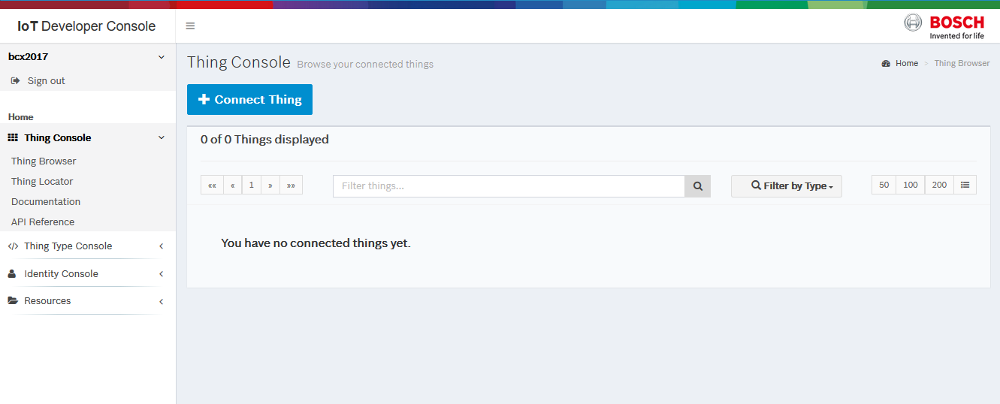
        

      </td>
    </tr>
    <tr>
      <td colspan="1">4.</td>
      <td colspan="1">
        
Search the Vorto repository for <em>xdk</em> and select it in the result table and confirm with <em>Next</em>.

        

          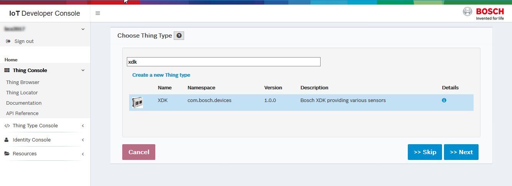
        

      </td>
    </tr>
    <tr>
      <td colspan="1">5.</td>
      <td colspan="1">Choose <strong>HTTP</strong> as a connector and confirm with <em>Next</em>.</td>
    </tr>
    <tr>
      <td colspan="1">6.</td>
      <td colspan="1">
        
Now, you can give your XDK a specific name in order to identify uniquely. For example

        
Namespace: demo.vorto.example

        
Name: <em>Leave blank</em>
        

        
Technical ID: &lt;bluetooth address of XDK without colons&gt;

        
Confirm with <em>Complete.</em>
        

      </td>
    </tr>
    <tr>
      <td colspan="1">7.</td>
      <td colspan="1">
        
Now you have successfully registered your XDK with the Suite for a given XDK information model.

        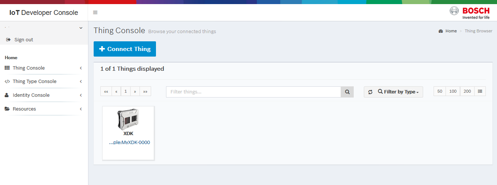
      </td>
    </tr>
    <tr>
      <td colspan="1">8.</td>
      <td colspan="1">
        
Before we can start sending as well as consuming device data, we need to grant the access permissions for the device and the application:

        <ol>
          <li>First open the XDK details page of the <a href="https://console.bosch-iot-suite.com">Developer Console</a>
          </li>
          <li>Click the <strong>Permissions</strong> tab and click <strong>New Entry</strong>
          </li>
          <li>Add the ID of the the device, e.g. <em>&lt;mysolutionID&gt;:myxdk</em> and click <strong>Save</strong>
          </li>
        </ol>
        

          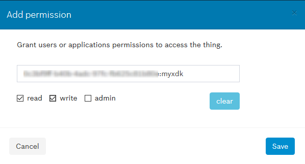
        

        
4. Repeat the steps to create another permission ACL for the xdk web application, that we are going to develop in the next chapter.

        
    Call the ID of the app, e.g. <em>&lt;mysolutionID&gt;:xdkapp </em>and grant the read and write permissions. Click <em>Save</em> to confirm.

        

          
        

      </td>
    </tr>
    <tr>
      <td colspan="1">9.</td>
      <td colspan="1">
        Way to go! Now you have your own claimed XDK instance registered in the Suite and we can go ahead and build an app with Vorto that receives and visualizes XDK data.</td>
    </tr>
  </tbody>
</table>

# Step 3: Create XDK web application that visualizes XDK data

In this step, we want to build a small Spring-boot based IoT webapp that is able to display the XDK sensor values in a dashboard. At this point, we use the Vorto XDK Information model to help us getting started with that easily:

<table>
  <tbody>
    <tr>
      <td>1.</td>
      <td>
        
Go to the <a href="http://vorto.eclipse.org/#/details/com.bosch.devices/XDK/1.0.0">XDK Information Model</a> and select 'Web-based Device Dashboard' from the list of generators on the right hand-side.

        

           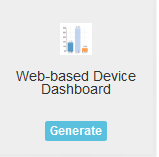
        

      </td>
    </tr>
    <tr>
      <td>2.</td>
      <td>
        
In the generator configuration page, select the <strong>Bosch IoT Suite</strong> as a cloud platform connector. Feel free to select other add-ons as needed:

        

          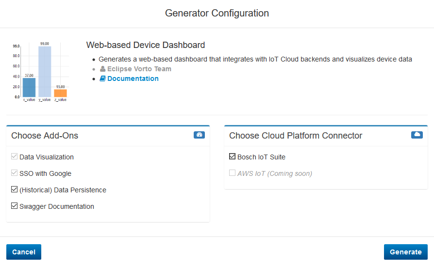
        

        
By clicking <strong>Generate</strong>, the generator generates a ZIP achieve containing a maven project of the XDK dashboard spring-boot application.

      </td>
    </tr>
    <tr>
      <td colspan="1">3.</td>
      <td colspan="1">
        <strong>Unzip </strong>and <strong>import </strong>the project as a Maven Project into your Eclipse IDE.</td>
    </tr>
    <tr>
      <td colspan="1">4.</td>
      <td colspan="1">
        
Download <a href="https://github.com/bsinno/iot-things-examples/blob/master/cr-integration-api-examples/common/src/main/resources/bosch-iot-cloud.jks">https://github.com/bsinno/iot-things-examples/blob/master/cr-integration-api-examples/common/src/main/resources/bosch-iot-cloud.jks</a>
        

        
and store this file under <em>src/main/resource/secure/bosch-iot-cloud.jks</em>
        

      </td>
    </tr>
    <tr>
      <td colspan="1">5.</td>
      <td colspan="1">
        
Create a <a href="https://things.apps.bosch-iot-cloud.com/dokuwiki/doku.php?id=002_getting_started:booking:manage-solution-ui#private_and_public_key">public and private key for your solution</a> and store the CRClient.jks private key under <em>src/main/resource/secure/CRClient.jks</em>
        

      </td>
    </tr>
    <tr>
      <td colspan="1">6.</td>
      <td colspan="1">
        
Open the <em>src/main/resources/application.yml </em>and insert the Bosch IoT Permissions and Bosch IoT Things credentials including the paths to the keystore that you just created with the keytool.

        <pre><code>bosch:
  permissions:
    endpointUrl: https://permissions-api.apps.bosch-iot-cloud.com
    clientId: [enter Bosch IoT Permissions client id here]
    clientSecret: [enter Bosch IoT Permissions secret here]
  things:
    alias: CR
    alias.password: [enter key alias password here ]
    endpointUrl : https://things.apps.bosch-iot-cloud.com
    wsEndpointUrl : wss://events.apps.bosch-iot-cloud.com
    apiToken: [enter Bosch IoT Things API Token here ]
    keystoreLocation : /secure/CRClient.jks
    trustStoreLocation : /secure/bosch-iot-cloud.jks
    trustStorePassword : jks
    solutionid: [enter Bosch IoT Things solution ID here ]
    keystore:
      password: [enter keystore password here ]]]>
    </code></pre>
    
<b>Behind proxy ?</b>

    
1) Add proxy information in the application.yml

    
2) Open java class com.example.iot.xdk.config.LocalConfiguration and uncomment the proxy authentication configuration.

      </td>
    </tr>
    <tr>
      <td colspan="1">7.</td>
      <td colspan="1">
        
Open the <em>com.example.iot.xdk.config.LocalConfiguration</em> and use the clientID <em>&lt;mysolutionID&gt; + ":xdkapp. </em>
        

            
Make sure the <strong>clientID</strong> in your configuration matches the clientID in the ACL that you had created via the Developer Console earlier!

      </td>
    </tr>
    <tr>
      <td colspan="1">8.</td>
      <td colspan="1">
        
Open your browser under <a href="http://localhost:8080">http://localhost:8080</a>
        

        

          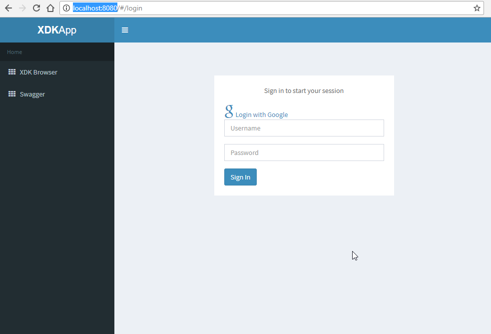
        

      </td>
    </tr>
    <tr>
      <td colspan="1">8.</td>
      <td colspan="1">
        
Login with your Bosch IoT Permissions credentials, e.g:

        
Username: <em>mytenantId\myuser</em>
        

        
Password: <em>mypassword</em>
        

      </td>
    </tr>
    <tr>
      <td colspan="1">9.</td>
      <td colspan="1">
        
After successful authentication, you can see the XDK device, that you had registered earlier (see chapter " Register / Pre-commission device in Bosch IoT Suite")

        

           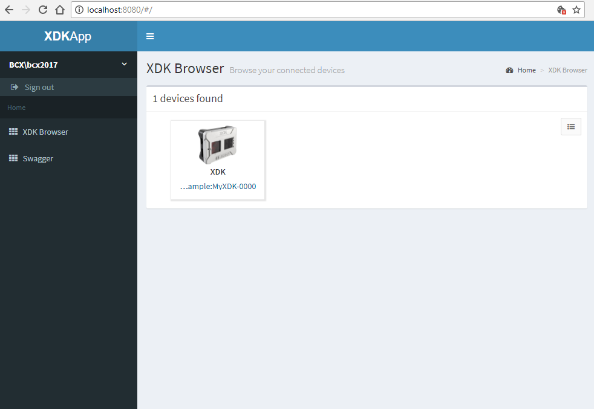
        

      </td>
    </tr>
    <tr>
      <td colspan="1">10.</td>
      <td colspan="1">
        
Click on the XDK device to see the details containing UI widgets to potentially display sensor values.

        

           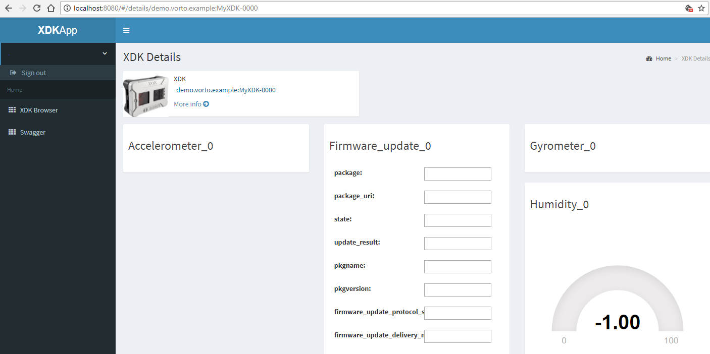
        

        
 

      </td>
    </tr>
    <tr>
      <td colspan="1">11.</td>
      <td colspan="1">
        <b>Fantastic!</b> Your app is ready to receive XDK telemetry data. As no data has been sent to Bosch IoT Suite yet, the UI fields are not yet populated. Let's change that and send some test values and check if our app doesn't break.</td>
    </tr>
  </tbody>
</table>

# Step 4: Simulate the XDK data

At this point, we would like to test our web application and check if the UI widgets are able to display sensor data coming from the Bosch IoT Suite. Let's create a small java-based device simulator and send XDK specific test data to the Bosch IoT Suite:

<table>
  <tbody>
    <tr>
      <td>1.</td>
      <td>
        
Go to the <a href="http://vorto.eclipse.org/#/details/com.bosch.devices/XDK/1.0.0">XDK Information Model</a> and select 'Bosch IoT Suite' from the list of generators on the right hand-side.

        

            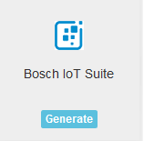
        

      </td>
    </tr>
    <tr>
      <td>2.</td>
      <td>
        
Select <em>Device Simulator</em> and hit <strong>Generate</strong>. Download and save the generated maven project bundle.

        

           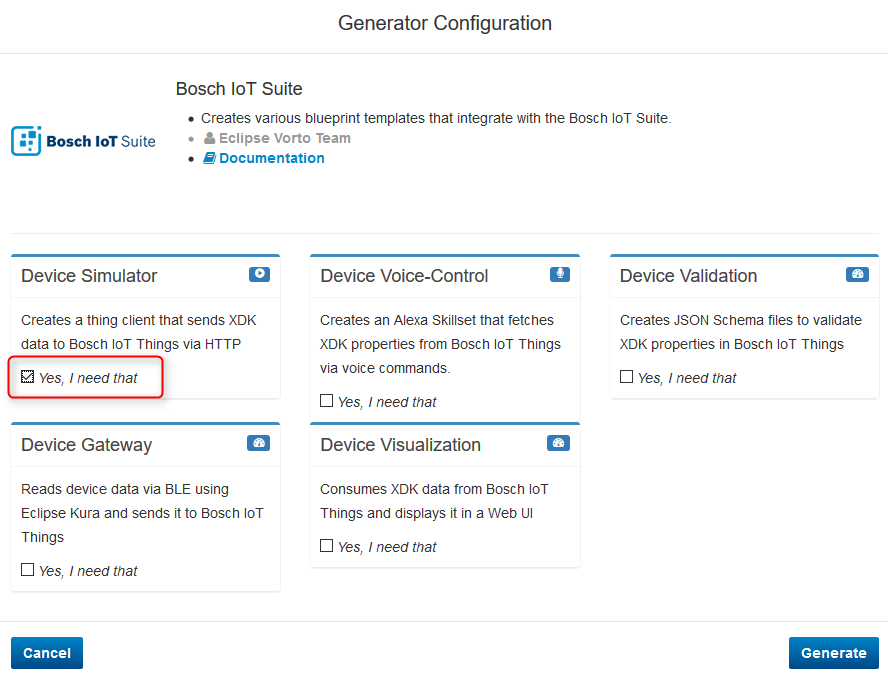
        

      </td>
    </tr>
    <tr>
      <td colspan="1">3.</td>
      <td colspan="1">
        <strong>Unzip </strong>and <strong>import </strong>the project as a Maven Project into your Eclipse IDE.</td>
    </tr>
    <tr>
      <td colspan="1">4.</td>
      <td colspan="1">
        
Download <a href="https://github.com/bsinno/iot-things-examples/blob/master/cr-integration-api-examples/common/src/main/resources/bosch-iot-cloud.jks">https://github.com/bsinno/iot-things-examples/blob/master/cr-integration-api-examples/common/src/main/resources/bosch-iot-cloud.jks</a>
        

        
and store this file under <em>src/main/resource/secure/bosch-iot-cloud.jks</em>
        

        
Copy the CRClient.jks from before and store it under <em>src/main/resource/secure/CRClient.jks</em>
        

      </td>
    </tr>
    <tr>
      <td colspan="1">5.</td>
      <td colspan="1">
        
Open the java class <em>com.example.things.ThingClientFactory</em> and insert your evaluation credentials as well as change the keystore resource paths.

            
Use the &lt;mysolutionID&gt; + ":myxdk as the client ID.

            
This ClientID must match the ACL that you had created earlier via the Developer Console

      </td>
    </tr>
    <tr>
      <td colspan="1">6.</td>
      <td colspan="1">Open the java class <em>com.example.things.XDKThingsClient</em> and specify the thing ID that you haven chosen during the device registration.</td>
    </tr>
    <tr>
      <td colspan="1">7.</td>
      <td colspan="1">Run <em>com.example.things.XDKThingsClient</em> as a java application and open your web browser <a href="http://localhost:8080">http://localhost:8080</a>
      </td>
    </tr>
    <tr>
      <td colspan="1">8.</td>
      <td colspan="1">
        
Open XDK details page. You should see the test data received from Bosch IoT Suite.

        

          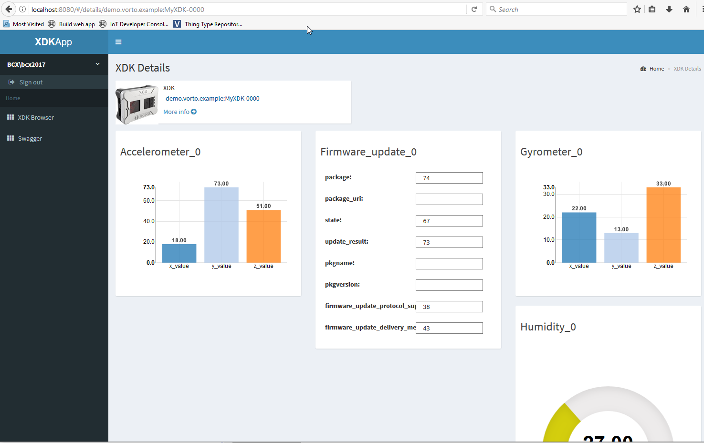
        

      </td>
    </tr>
    <tr>
      <td colspan="1">9.</td>
      <td colspan="1">
        <b>Wow!</b> You have just simulated the XDK device by sending out dummy data that are compliant to a well defined Vorto model. Now that we know that the app is able to display data coming from the Bosch IoT Suite, it's time to send actual XDK sensor data.</td>
    </tr>
  </tbody>
</table>

# Step 5: Connect the Bosch XDK via Bluetooth LE using Eclipse Kura

Our backend functionality works fine, but it's not really actual sensor data from the device yet. Let's change that and connect the XDK via Bluetooth to the Bosch IoT Suite. As long as the sent data complies to the Vorto information model, our backend web application should not break. Let's go:

<table>
  <tbody>
    <tr>
      <td colspan="1">1</td>
      <td colspan="1">
        
Install the Kura gateway on a Raspberry Pi - <a href="http://eclipse.github.io/kura/intro/raspberry-pi-quick-start.html">http://eclipse.github.io/kura/intro/raspberry-pi-quick-start.html</a>
        

        <ul>
          <li>The easiest path would be to use a Raspberry Pi 3 since it already contains bluetooth that is supported. If you use a bluetooth adapter, make sure it is supported by the operating system.</li>
        </ul>
      </td>
    </tr>
    <tr>
      <td colspan="1">2</td>
      <td colspan="1">
        
Modify the Kura gateway on the Raspberry Pi

        <ul>
          <li>
            
Change from OpenJDK to Oracle JDK

            <pre><code>sudo apt-get install oracle-java8-jdk
sudo update-alternatives --config java</code></pre>
			</li>
          <li>
            
Add some configuration in Kura init 

            <pre><code>sudo nano /opt/eclipse/kura/kura/config.ini</code></pre>          
Add this line to the end of the file

            <ac:structured-macro ac:name="code">
              <pre><code>org.osgi.framework.bootdelegation=sun.*,com.sun.*</code></pre>          </li>
          <li>
            
Reboot.

            <pre><code>sudo reboot</code></pre>          </li>
          <li>On the Kura web application, change the necessary firewall rules to suit your development environment<ul>
              <li>
                
The Kura gateway will create its own wifi access point. If you have a second network on the Raspberry Pi (i.e Using the Ethernet cable), join that network. Check the raspberry pi for its IP  on that network. Use that IP Address to reach the Kura web application. It is on http://[IP Address]/kura.

              </li>
              <li>
                
If your raspberry pi doesn't have a second network, you can join the Wifi Access Point created by the Kura gateway, and reach the Kura web application from there via it's IP on that network.

              </li>
            </ul>
          </li>
        </ul>
      </td>
    </tr>
    <tr>
      <td colspan="1">3</td>
      <td colspan="1">
        
Create a Kura Development Environment (More comprehensive tutorial here: <a href="http://eclipse.github.io/kura/dev/kura-setup.html">http://eclipse.github.io/kura/dev/kura-setup.html</a>)

        <ul>
          <li>Install Eclipse Neon (the version that allows Plugin Development)</li>
          <li>Install mToolkit as new software in Eclipse (URL : <a href="http://mtoolkit-neon.s3-website-us-east-1.amazonaws.com">http://mtoolkit-neon.s3-website-us-east-1.amazonaws.com</a>)</li>
          <li>Download Kura's Developer's Workspace Archive (<a href="http://www.eclipse.org/downloads/download.php?file=/kura/releases/3.0.0/user_workspace_archive_3.0.0.zip">http://www.eclipse.org/downloads/download.php?file=/kura/releases/3.0.0/user_workspace_archive_3.0.0.zip</a>)</li>
          <li>Unzip Developer's Workspace Archive to workspaceImport the unzipped projects</li>
          <li>Go to "Target Definition" project, click on kura-equinox_3.11.1.target, and click "Set as Target Platform"</li>
        </ul>
      </td>
    </tr>
    <tr>
      <td colspan="1">4</td>
      <td colspan="1">
        
Generate the XDK Kura Bundle from Vorto

        <ul>
          <li>Go to the <a href="http://vorto.eclipse.org/#/details/com.bosch.devices/XDK/1.0.0">XDK Information Model</a> in the Vorto Repository</li>
          <li>Click on the <strong>Eclipse Kura Generator</strong>: 
             
              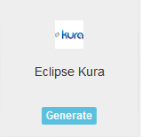
          </li>
          <li>Select <strong>Bluetooth LE</strong> and <strong>Bosch IoT Suite</strong>
             
            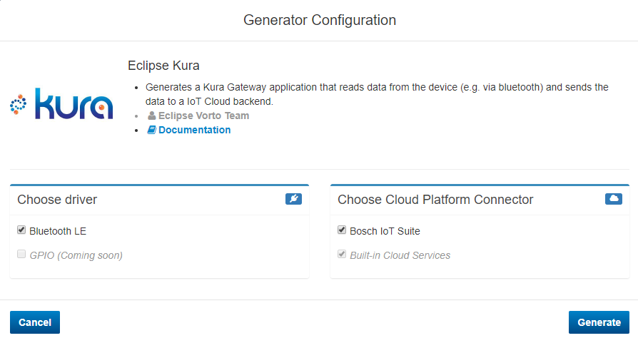
          </li>
          <li>Confirm your selection with <strong>Generate</strong>
          </li>
        </ul>
      </td>
    </tr>
    <tr>
      <td colspan="1">5</td>
      <td colspan="1">Unzip the generated XDK Kura bundle to Eclipse workspace and import. The project will appear as <em>com.example.kura</em>.</td>
    </tr>
    <tr>
      <td colspan="1">6</td>
      <td colspan="1">
        
Add dependencies to XDK Kura bundle

        <ul>
          <li>Replace the JRE in build path to local JRE. Go to "<em>Build Path &gt; Configure Build Path &gt; Libraries</em>", remove library with Error and "Add JRE System Library"</li>
          <li>Create a "secret" folder on the root, and add the keystore and truststore files you generated on the steps above.</li>
          <li>Create a "lib" folder on the root and add all the Things Integration Client dependencies</li>
        </ul>
      </td>
    </tr>
    <tr>
      <td colspan="1">7</td>
      <td colspan="1">
        
Add application logic

        <ol>
          <li>Firmware on the device side<ol>
              <li>Download XDK workbench [<a href="https://xdk.bosch-connectivity.com/software-downloads">https://xdk.bosch-connectivity.com/software-downloads</a>]</li>
              <li>Open your XDK workbench and import the SensorsToBle project [<ac:link>
                  <a href="./tutorials/examples/SensorsToBle.zip">XDK Firmware</a></li>
              <li>Flash the SensorsToBle project to the XDK (Please consult the XDK manual for doing this.</li>
            </ol>
          </li>
          <li>On the XDK Kura bundle<ol>
              <li>
                
In <em>ThingClientFactory.java</em>, add your network proxy if you need one and uncomment the line below:

                <pre><code>.proxyConfiguration(proxy)</code></pre>              </li>
              <li>
                
In XDKDevice.java, in the method getResourceId(), modify the method to how you intend to generate the ThingID of your XDK Thing. Make sure this aligns with the ThingID of the Thing you precommissioned in Chapter 2 of this guide.

                <pre><code>return "xdk:" + getBluetoothDevice().getAdress().replace(":", ""); </code></pre>                
In our particular implementation, we will get the bluetooth address, strip the colons (":"), and prepend it with "xdk:"

              </li>
              <li>
                
In XDKDevice.java, in the method enableTemperature_0(), change the entire method to 

                <pre><code>this.bluetoothGatt.writeCharacteristicValue("0x0013", "0100");</code></pre>
                
This will turn-ON notifications for the XDK Bluetooth LE.

              </li>
              <li>
                
In XDKDevice.java, in the method readTemperature(), change the entire method to 

                <pre><code>TemperatureSensor temperature = new TemperatureSensor();
try {
	this.bluetoothGatt.writeCharacteristicValue("0x0010", "74656D70");
	String btReturnValue = this.bluetoothGatt.readCharacteristicValue("0x0012");
	String[] btReturnValues = btReturnValue.split("\\s+");
	StringBuilder number = new StringBuilder();
	for(String hex : btReturnValues) {
		number.append((char) Integer.parseInt(hex, 16));
	}
	
	temperature.setSensorValue((float) (Float.parseFloat(number.toString())/1000.0));
	temperature.setUnits("Celsius");
} catch (KuraException e) {
	logger.error("Error in Sending Temperature", e);
}
return temperature;</code></pre>
                
Here we are writing the ascii representation of the string "temp" to the XDK register to get a reading of the temperature which we then read back and parse.

                
 

              </li>
            </ol>
          </li>
        </ol>
      </td>
    </tr>
    <tr>
      <td colspan="1">8</td>
      <td colspan="1">
        
Deploy the XDK Kura bundle to the Kura gateway created on Step 1.

        <ol>
          <li>Connect to Kura gateway wifi (created on Step 1) or if your gateway has a second network connection, make sure to be on the same network.</li>
          <li>Open mToolkit view (<em>Windows &gt; Show View &gt; Other &gt; mToolkit &gt; Frameworks</em>)</li>
          <li>Add Framework <ol>
              <li>Click on Add Framework icon on top right</li>
              <li>Put IP of running Kura Gateway on IP Address</li>
              <li>Make sure running Kura Gateway's port 1450 is open (configure this on Kura gateway app)</li>
            </ol>
          </li>
          <li>Right click on created framework and click Connect Framework</li>
          <li>Right click on Kura bundle (com.example.kura), go to "Install To", and click on the Framework you added.</li>
          <li>Verify that your plugin was installed by looking for it under Bundles</li>
          <li>Alternatively, you can verify by looking for it in the Kura web app (Device &gt; Bundles)</li>
        </ol>
      </td>
    </tr>
    <tr>
      <td colspan="1">9</td>
      <td colspan="1">
        
Change the configuration of our XDK Kura bundle

        <ol>
          <li>Go to the Kura webapp and look for the configuration page of our Bundle 
            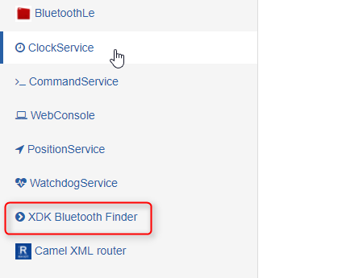
          </li>
          <li>Put solution id 
            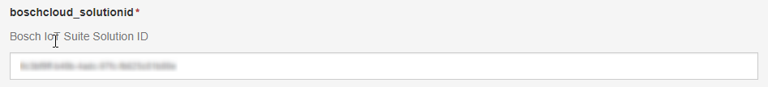
          </li>
          <li>Enable scanning 
            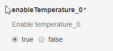
          </li>
          <li>Enable temperature 
            
             
             
          </li>
        </ol>
      </td>
    </tr>
    <tr>
      <td colspan="1">10</td>
      <td colspan="1">
        
Verify changes in Bosch IoT Suite

        <ul>
          <li>Via the <a href="http://Bosch IoT Developer Console">Bosch IoT Developer Console</a>
          </li>
          <li>Via the previously generated XDK web application</li>
        </ul>
      </td>
    </tr>
    <tr>
      <td colspan="1">11.</td>
      <td colspan="1">
        </b>Great!!</b> The XDK is now sending temperature data via bluetooth to the Bosch IoT Suite and it's visualized in our web application.</td>
    </tr>
  </tbody>
</table>

# Step 6: Voice - Control the XDK with Amazon Alexa

We are almost there and completed our entire IoT XDK solution. The only thing left is to add voice-control for the XDK. Amazon Alexa is a nice voice-control service we can use. But how do we bring that service together with our XDK ? Not a problem! Vorto can assist us here too:

<table>
  <tbody>
    <tr>
      <td>1.</td>
      <td>
        
Go to the <a href="http://vorto.eclipse.org/#/details/com.bosch.devices/XDK/1.0.0">XDK Information Model</a> and select 'AWS IoT' from the list of generators on the right hand-side.

        

            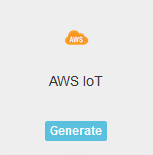
        

      </td>
    </tr>
    <tr>
      <td>2</td>
      <td>
        
In the generator configuration page, select <strong>Bosch IoT Suite</strong> as the digital twin backend. Confirm your selection with <strong>Generate</strong>:

        

          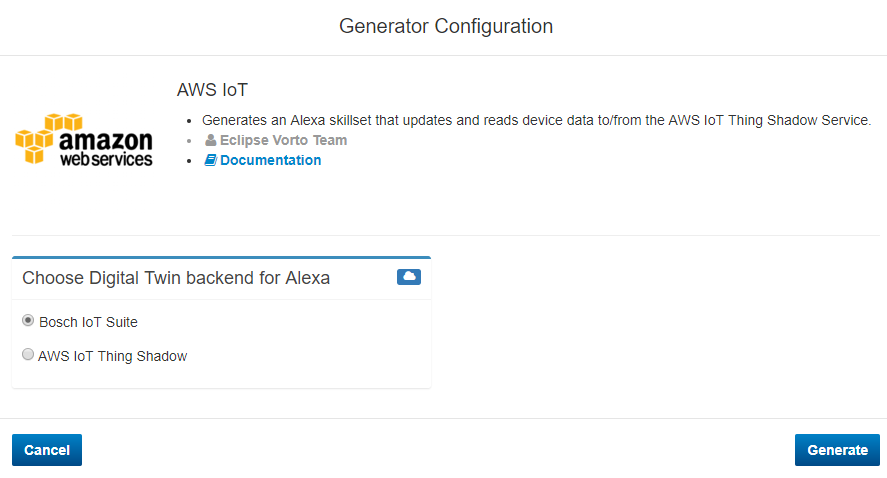
        

      </td>
    </tr>
    <tr>
      <td colspan="1">3.</td>
      <td colspan="1">
        
Download and unzip the generated bundle. It should contain 3 generated sources for the XDK Information Model:

        <table>
          <tbody>
            <tr>
              <th>alexa-skillset-lambda.js</th>
              <td>AWS Lambda function containing the skillset behaviour</td>
            </tr>
            <tr>
              <th>IntendSchema.json</th>
              <td>Skillset grammar</td>
            </tr>
            <tr>
              <th colspan="1">xdkUtterances.txt</th>
              <td colspan="1">A list of speech commands for each grammar intend</td>
            </tr>
          </tbody>
        </table>
      </td>
    </tr>
    <tr>
      <td colspan="1">4.</td>
      <td colspan="1">Open the <a href="https://console.aws.amazon.com/lambda/home">AWS Lambda console</a> and create a new function</td>
    </tr>
    <tr>
      <td colspan="1">5.</td>
      <td colspan="1">
        
Select <strong>Alexa Skills Kit</strong> as the trigger triggering the new function and confirm with <strong>Next</strong>:

        

          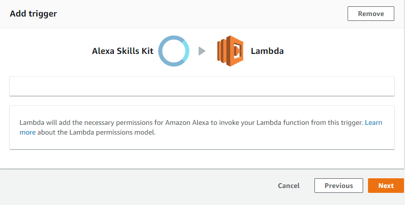
        

      </td>
    </tr>
    <tr>
      <td colspan="1">6.</td>
      <td colspan="1">
        
Give your function a name, leave the Runtime default configuration and Copy and Paste the generated alexa-skillset-lambda function in the online editor:

        

          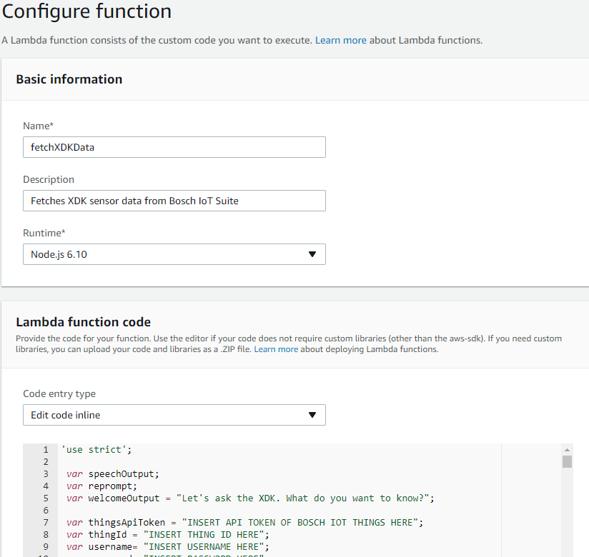
        

      </td>
    </tr>
    <tr>
      <td colspan="1">7.</td>
      <td colspan="1">
        
Change the code and insert your thingsApiToken, thingID, username and password.

        
Make sure to encode the tenant in the username. Example &lt;tenantId&gt;\&lt;username&gt;

             </td>
    </tr>
    <tr>
      <td colspan="1">8.</td>
      <td colspan="1">Open the <a href="https://developer.amazon.com/edw/home.html#/skills">AWS Alexa Skillset Builder</a> and select <strong>Add a New Skill</strong>
      </td>
    </tr>
    <tr>
      <td colspan="1">9.</td>
      <td colspan="1">Give the skill a name, e.g. XDKDemo, and an Invocation Name, e.g. XDK. Confirm with <strong>Next</strong>.</td>
    </tr>
    <tr>
      <td colspan="1">10.</td>
      <td colspan="1">Copy and Paste the <strong>intent schema</strong> as well as <strong>utterances</strong>, you generated earlier, in the online editor. Confirm with <strong>Next</strong>.</td>
    </tr>
    <tr>
      <td colspan="1">11.</td>
      <td colspan="1">
        
Select AWS Lambda ARN Endpoint and add the ARN.

        <ac:structured-macro ac:name="info">
          <ac:rich-text-body>
            
You can get the ARN of your lambda function in the lambda console.

          </ac:rich-text-body>
        </ac:structured-macro>
      </td>
    </tr>
    <tr>
      <td colspan="1">12.</td>
      <td colspan="1">
        
Test your Skill by entering an utterance. For example

        

          <em>"Get temperature sensor value"</em>
        

        
The output should be the temperature value sent by the XDK, as shown in your web application.

      </td>
    </tr>
    <tr>
      <td colspan="1">13.</td>
      <td colspan="1">
        

          <b>That's it!</b> You have just generated an Alexa skillset that reads the XDK sensor data from Bosch IoT Suite and outputs it as speech. Feel free to modify the utterances in the skillset builder or add additional behavior in the lambda function.  

      </td>
    </tr>
  </tbody>
</table>

