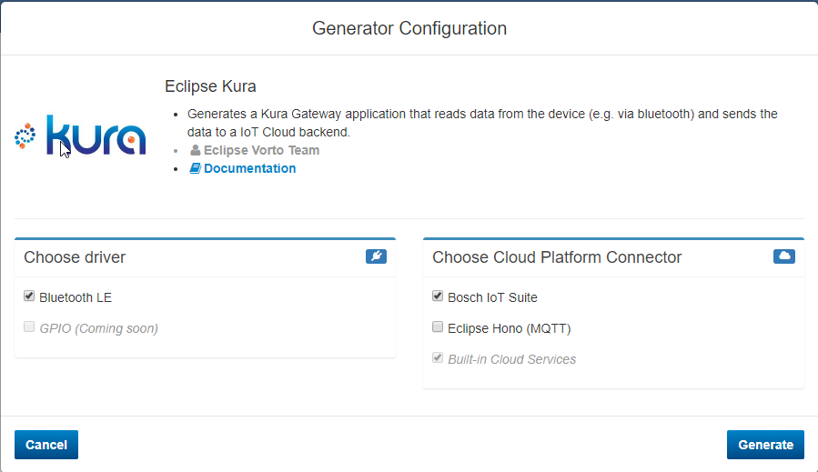

# Connecting a Bluetooth device with Eclipse Vorto & Eclipse Kura to the Bosch IoT Suite

In this tutorial you are going to learn how you can connect a bluetooth device to the Bosch IoT Suite with Eclipse Kura and Eclipse Vorto.

## Prerequisite

- You have successfully booked the following services:
	- Bosch IoT Things Service
	- Bosch IoT Permissions Service
- [Publish](tutorial-create_and_publish_with_web_editor.md) an information model for the device to the Vorto Repository.    
- [Register](tutorial_register_device.md) the device in the Bosch IoT Suite.

## Tools
- [Eclipse Oxygen](https://www.eclipse.org/downloads/packages/eclipse-ide-java-and-dsl-developers/oxygenr)
- [mToolkit](http://mtoolkit-neon.s3-website-us-east-1.amazonaws.com) for deploying Kura bundles to the Pi
- [Kura's Developer's Workspace Archive](http://www.eclipse.org/downloads/download.php?file=/kura/releases/3.0.0/user_workspace_archive_3.0.0.zip)
- [Eclipse XDK Workbench 2.0.1](https://xdk.bosch-connectivity.com/software-downloads) for flashing the XDK firmware


## Steps

### 1. Install Kura on a Raspberry Pi

1. <a href="http://eclipse.github.io/kura/intro/raspberry-pi-quick-start.html">Install the Kura gateway on a Raspberry Pi</a>. The easiest path would be to use a Raspberry Pi 3 since it already contains bluetooth that is supported. If you use a bluetooth adapter, make sure it is supported by the operating system

2. Modify the Kura gateway on the Raspberry Pi

- Change from OpenJDK to Oracle JDK

```
sudo apt-get install oracle-java8-jdk
sudo update-alternatives --config java
```

- Add some configuration in Kura init

```
sudo nano /opt/eclipse/kura/kura/config.ini
```

- Add this line to the end of the file

```
org.osgi.framework.bootdelegation=sun.*,com.sun.*
```

- Reboot with `sudo reboot`
- On the Kura web application, change the necessary firewall rules to suit your development environment
	- The Kura gateway will create its own wifi access point. If you have a second network on the Raspberry Pi (i.e Using the Ethernet cable), join that network. Check the raspberry pi for its IP
on that network. Use that IP Address to reach the Kura web application. It is on http://[IP Address]/kura.
	- If your raspberry pi doesn't have a second network, you can join the Wifi Access Point created by the Kura gateway, and reach the Kura web application from there via it's IP on that network.

### 2. Create Kura Development Environment

More comprehensive tutorial here: <a href="http://eclipse.github.io/kura/dev/kura-setup.html">http://eclipse.github.io/kura/dev/kura-setup.html</a>

- Start your Eclipse IDE
- Install <a href="http://mtoolkit-neon.s3-website-us-east-1.amazonaws.com">mToolkit</a> as new software in Eclipse
- Download <a href="http://www.eclipse.org/downloads/download.php?file=/kura/releases/3.0.0/user_workspace_archive_3.0.0.zip">Kura's Developer's Workspace Archive</a>
- Unzip Developer's Workspace Archive to workspaceImport the unzipped projects
- Go to "Target Definition" project, click on kura-equinox_3.11.1.target, and click "Set as Target Platform"

### 3. Generate XDK Kura Bundle with Vorto

- Go to the <a href="http://vorto.eclipse.org/#/details/com.bosch.devices/XDK/1.0.0">XDK Information Model</a> in the Vorto Repository
- Click on the **Eclipse Kura Generator**:

	

- Select **Bluetooth LE** and **Bosch IoT Suite**

	

- Confirm your selection with **Generate**
- Download the generated Kura bundle, unzip and import it to Eclipse workspace. The project will appear as _org.eclipse.vorto.kura.xdk_.
- Add dependencies to XDK Kura bundle by executing `mvn dependency:copy-dependencies` in the root of the kura project
- In Eclipse, refresh your project, then right-click on your project, go to _Plug-in Tools_, and click on _Update classpath_
- Rebuild your project.

### 4. Configure the bundle for the Bosch IoT Suite

- Download <a href="https://github.com/bsinno/iot-things-examples/blob/master/cr-integration-api-examples/common/src/main/resources/bosch-iot-cloud.jks">bosch-iot-cloud.jks</a> and store it in a "secret" folder of the kura project
- Create a public and private key pair for your solution. Store the CRClient in the "secret" folder as well
```
keytool -genkeypair -noprompt
-dname "CN=-, OU=-, O=-, L=-, S=-, C=-"
-keyalg EC -alias CR -sigalg SHA512withECDSA
-validity 365 -keystore CRClient.jks
```
- Extract the public key information into a separate file
```
keytool -export -keystore CRClient.jks -alias CR -rfc -file CRClient_key.cer
```
- Print the public key to the command prompt
```
keytool -printcert -rfc -file CRClient_key.cer
```
- Open the Things Adminstration Dashboard for your solution and submit your public key by copy&pasting the key from the command prompt

	

### 5. Brief primers to the components we use

- The Virtual XDK Firmware

The Virtual XDK firmware for the XDK was originally developed to show sensor values on mobile devices. As such, they were designed to give all sensor values as a stream in one go.
The sensors value stream is started by writing '00' on UUID handle _0x0039_. You can then read the continues stream of sensor values at UUID handle _0x0034_ and _0x0036_. The _0x0034_ contains values for
either a computed orientation or accelerometer and gyrometer. This behaviour is controlled by a flag that we will ask you to modify in Step #6. The _0x0036_ can be two streams. If it starts with 01,
then it contains values for the light sensor, noise sensor, pressure, temperature, humidity, sd card status, and button 1/2 states. If it starts with 02, then it contains values for the magnetometer,
and led states.

- The XDK Kura Bundle

The Vorto-generated XDK Kura Bundle is an OSGI-compliant bundle generated by Vorto from your chosen information model (in this case, the XDK), which is ready to be deployed to a Kura Gateway. It contains several functionalities
which can simplify development for Kura and bluetooth LE devices. Its main class, the `XDKBluetoothFinder`, implements a scanner for bluetooth LE devices, and for each found device, adds a skeleton framework for filtering (`XDKDeviceFilter.java`),
mapping to information model(`DeviceToXDKTransformer.java`), and consuming (`XDKConsumer.java`). It also implements a configuration system for enabling/disabling each function block (which allows it to be controlled from Kura's web application),
and several other configurable properties.

### 6. Flash Virtual XDK firmware

- Download XDK workbench [<a href="https://xdk.bosch-connectivity.com/software-downloads">https://xdk.bosch-connectivity.com/software-downloads</a>]
- Download the Virtual XDK project [<a href="https://xdk.bosch-connectivity.com/documents/37728/207253/VirtualXDK_v2.zip/9da73aa3-76f7-4c63-a0be-3eb39025d3af">Virtual XDK</a>] and import the XDK folder to the XDK workbench
- In the XDK workbench, go to the file VXA_bluetoothLE_cc.c, and find the line ```uint8_t isUseBuiltInSensorFusion = 1;``` and change to ```uint8_t isUseBuiltInSensorFusion = 0;```.
  Explanation: The Virtual XDK firmware, by default, sends us the computed "Orientation" value instead of the Accelerometer and Gyrometer values
- Flash the firmware project onto the XDK device (Please consult the XDK manual for doing this)

### 7. Read temperature from Bluetooth in the XDK Kura Bundle

- In _DeviceToXDKTransformer.java_, in the method `getResourceId(...)`, modify the method to how you intend to generate the ThingID of your XDK Thing. Make sure this aligns with the ThingID of the Thing you precommissioned in the Register step [<a href="https://github.com/eclipse/vorto/blob/development/tutorials/tutorial_register_device.md">Register</a>]
	```
	private String getResourceId(BluetoothDevice device) {
		return "XDK:" + device.getAdress().replace(":", "");
	}
	```

- Create a new package in the Kura bundle, name it _org.eclipse.vorto.kura.xdk.device_. We will put classes that implements reading from the XDK here.

- In the new package, create a model class to hold the response data from the XDK. Let's also give it the responsibility to segregate string responses according to what type of sensor values it holds.

	Let's create the class _XDKSensorDataResponse_. You can download the full class here [<a href="https://github.com/eclipse/vorto/blob/development/tutorials/sample_codes/tutorial_connect_xdk_ble/XDKSensorDataResponse.txt">XDKSensorDataResponse.java</a>].

	Here are the juicy tidbits of this class.
	```
	public boolean accept(String response) {
		if (response != null) {
			String[] components = response.split("\\s+");
			if (components.length > 5 && components[3].equals("0x0036") && components[5].equals("01")) {
				environmentSensor = Optional.of(response);
			} else if (components.length > 3 && components[3].equals("0x0034")) {
				accAndGyro = Optional.of(response);
			} else if (components.length > 5 && components[3].equals("0x0036") && components[5].equals("02")) {
				magnetometerLedStatus = Optional.of(response);
			} else {
				return false;
			}

			return true;
		}

		return false;
	}
	public boolean isComplete() {
		return accAndGyro.isPresent() && environmentSensor.isPresent() && magnetometerLedStatus.isPresent();
	}

	public boolean isPartiallyComplete() {
		return accAndGyro.isPresent() || environmentSensor.isPresent() || magnetometerLedStatus.isPresent();
	}
	```
	`accept(...)` accepts a string and classifies the type of information in it. The last two functions are helper functions to check if we have a complete set of sensor informations.

- In the new package, create our own implementation of Kura's bluetooth gatt. This is because Kura's implementation uses a different command to write a string, which doesn't trigger the Virtual XDK firmware.

	Let's create a class called _XDKBluetoothGatt_ that implements _org.eclipse.kura.bluetooth.BluetoothGatt_. We are only interested in the functions for connecting, writing and reading to a UUID. The rest we can leave
	to Eclipse's own default. You can download the entire class here [<a href="https://github.com/eclipse/vorto/blob/development/tutorials/sample_codes/tutorial_connect_xdk_ble/XDKBluetoothGatt.txt">XDKBluetoothGatt.java</a>].

	```
	public boolean connect(String adapterId) throws KuraException {
		return connect();
	}

	public boolean connect() throws KuraException {
		dataResponse = getSensorData(bluetoothAddress);  
		return dataResponse.isComplete() || dataResponse.isPartiallyComplete();
	}

	public void writeCharacteristicValue(String arg0, String arg1) {}

	public String readCharacteristicValue(String uuid) throws KuraException  {
		if (uuid.equals("0x0034")) {
			return dataResponse.getAccAndGyro().orElse(null);
		} else if (uuid.equals("0x003601")) {
			return dataResponse.getEnvironmentSensor().orElse(null);
		} else if (uuid.equals("0x003602")) {
			return dataResponse.getMagnetometerLedStatus().orElse(null);
		}

		return null;
	}

	private XDKSensorDataResponse getSensorData(String bluetoothAddress) {
		XDKSensorDataResponse dataResponse = new XDKSensorDataResponse();

		try {
			logger.info("Executing gatttool process now on " + bluetoothAddress);
			Process process = new ProcessBuilder("gatttool",
					"--device=" + bluetoothAddress, "--char-write-req", "--value=00",
					"--handle=0x0039", "--listen").start();
			logger.info("Process started.");
			BufferedReader outputReader = new BufferedReader(new InputStreamReader(process.getInputStream()));

			ExecutorService processExecutorService = Executors.newSingleThreadExecutor();

			boolean read = true;
			while(read) {
				try {
					Future<String> responseReader = processExecutorService.submit(new Callable<String>() {
						@Override
						public String call() throws Exception {
							return outputReader.readLine();
						}
					});

					dataResponse.accept(responseReader.get(5, TimeUnit.SECONDS));

					if (dataResponse.isComplete()) {
						read = false;
						process.destroy();
					}

				} catch (TimeoutException e) {
					logger.info("No more data to be read from bluetooth process.");
					read = false;
					process.destroy();
				} catch (ExecutionException | InterruptedException e) {
					logger.error("Error : ", e);
				}
			}

			logger.info(dataResponse.toString());

		} catch (IOException e) {
			logger.error("Error : ", e);
		}
		return dataResponse;
	}
	```

	The most important method here is `getSensorData()` which gets the sensor data from bluetooth using the gattool commandline tool, and then continually reads the result until we get a full set of sensor data.

- Replace the bluetooth gatt implementation in _DeviceToXDKTransformer.java_ to our implementation.
	In the method `apply(...)`, change this line
	```
	BluetoothGatt gatt = device.getBluetoothGatt();
	```
	to this line
	```
	BluetoothGatt gatt = new XDKBluetoothGatt(device.getAdress());
	```

- Modify the code in _DeviceToXDKTransformer.java_ that actually reads the sensor values. We will use the _Temperature_ sensor as an example. You can download the entire class here [<a href="https://github.com/eclipse/vorto/blob/development/tutorials/sample_codes/tutorial_connect_xdk_ble/DeviceToXDKTransformer.txt">DeviceToXDKTransformer.java</a>].
	- Find the method `getTemperature(...)` and modify to

	```
	private Temperature getTemperature(BluetoothGatt gatt) {
		Temperature temperature = new Temperature();
		try {
			String value = gatt.readCharacteristicValue("0x003601");
			if (value != null) {
				String[] components = value.split("\\s+");
				if (components.length > 18) {
					temperature.setSensor_value(((int) Long.parseLong(components[18] + components[17] + components[16] + components[15], 16))/1000);
					temperature.setSensor_units("Celsius");
					logger.info("temperature.getSensor_value() = " + temperature.getSensor_value());
				}
			}
		} catch (KuraException e) {
			 logger.error(e.toString());
		}
		return temperature;
	}
	```


### 8. Prepare your Bosch IoT Things client library

- In _ThingClientFactory.java_, add your network proxy if you need one and uncomment the line below:
```.proxyConfiguration(proxy)```

### 9. Deploy the XDK Kura Bundle to gateway

Let us now deploy the XDK Kura bundle to the Kura gateway on the Raspberry Pi.

- Connect to Kura gateway wifi (created on Step 1) or if your gateway has a second network connection, make sure to be on the same network.
- Open mToolkit view _(Windows > Show View > Other > mToolkit > Frameworks)_
- Add Framework
	- Click on Add Framework icon on top right
	- Put IP of running Kura Gateway on IP Address
	- Make sure running Kura Gateway's port 1450 is open (configure this on Kura gateway app)

- Right click on created framework and click Connect Framework
- Right click on Kura bundle (com.example.kura), go to "Install To", and click on the Framework you added.
- Verify that your plugin was installed by looking for it under Bundles
- Alternatively, you can verify by looking for it in the Kura web app (Device > Bundles)

### 10. Configure the XDK Kura Bundle

- Go to the Kura webapp and look for the configuration page of our Bundle

	

- Configure the Bosch IoT Things Solution Id. You can lookup the solution Id in the Bosch IoT Things Admin Dashboard. Check the email that has been sent to you during the Evaluation Account Registration

	

- In the device_filter, type in the Bluetooth MAC Address of your XDK

	

- Enable scanning

	

- Enable temperature

	

### 11. Verify incoming sensor data

To check if the temperature sensor data is being sent successfully to the cloud, just execute the following curl command:

```
curl -X GET https://things.apps.bosch-iot-cloud.com/api/1/things?ids=ADD_THINGID_HERE
-H "Authorization: Basic credentials"
-H "Accept: application/json"
-H "x-cr-api-token: apiToken"
```
Alternatively, you can the see the incoming sensor data via the <a href="https://console.bosch-iot-suite.com">Bosch IoT Developer Console</a>

## What's next ?

- [Create a web application consuming the device telemetry data](tutorial_create_webapp_dashboard.md)
- [Build an Amazon Alexa Skillset to voice-control the device](tutorial_voicecontrol_alexa.md)
