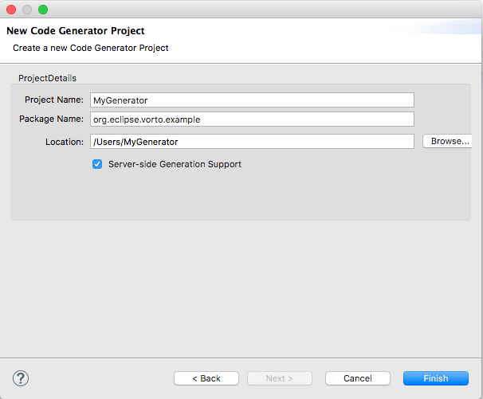
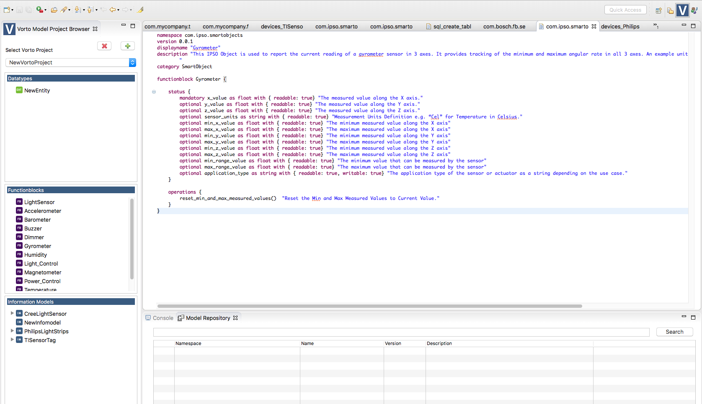

# Create and deploy a simple SQL code generator using Vorto


## Prerequisites
In order to follow this tutorial exactly, you need to download and install [Vorto Toolset Eclipse Plugins](https://marketplace.eclipse.org/content/vorto-toolset) from Eclipse Marketplace. 

 

## Overview
In this tutorial, we will talk about how to create a simple SQL database schema code generator using Eclipse Vorto Toolset. The purpose of this code generator is to convert a Vorto Information Model into an SQL schema automatically. After that we will also show you how to deploy this generator as a service for your Vorto Repository server. 


## Step 1: Create Code Generator
First let us fire up Eclispe and start a code generator project by following. Choose File->New->Project->Vorto->Code Generator Project. Name your project "SQLGenerator" as we are going to generate a simple SQL command to create a table in your SQL database. Here is a screenshot of the Code Generator wizard. Remeber to tick the Server-side Generation Support option as this will create the service project files which you will need to use later on.



Once your generator project is created successfully, you should be able to locate a file called "SQLGenerator.xtend". This file contains the core part of this generator project which is written in Xtend. Xtend is a high-level programming language which has its roots in Java but having more concise syntax and additional features. A more detailed introduction can be found [here](https://eclipse.org/xtend/documentation/index.html)

Add the following header imports at the top of your .xtend file.

```
import org.eclipse.vorto.core.api.model.informationmodel.InformationModel
import org.eclipse.vorto.core.api.model.functionblock.FunctionblockModel
import org.eclipse.vorto.core.api.model.datatype.ObjectPropertyType
import org.eclipse.vorto.core.api.model.datatype.PrimitivePropertyType
import org.eclipse.vorto.core.api.model.datatype.PrimitiveType
import org.eclipse.vorto.core.api.model.datatype.PropertyType
```

First, let us modify the file name of the SQL schema file we will generate using this generator. Change it to something like "sql_create_table.txt" as following.

```
override getFileName(InformationModel context) {
	return "sql_create_table.txt"
}

```

Second, let us create a simple utility function which maps the data type from your Vorto Information Models to SQL data types as following:

```
def getType(PropertyType propType) {
	if (propType instanceof PrimitivePropertyType) {
		var primitiveProp = propType as PrimitivePropertyType
		switch(primitiveProp.type) {
			case (PrimitiveType.STRING) : return "VARCHAR(255)"
			case (PrimitiveType.INT) : return "INT"
			case (PrimitiveType.DATETIME) : return "TIMESTAMP"
			case (PrimitiveType.DOUBLE) : return "DOUBLE PRECISION"
			case (PrimitiveType.FLOAT) : return "FLOAT"
			case (PrimitiveType.BOOLEAN) : return "BOOLEAN"
			default : return ""
		}
	} else {
		return (propType as ObjectPropertyType).type.name
		}
	}
}
```

Now, let us create the content that this generator will provide us. First let us think about our goal for a moment. If we want to create a table in our database, what would be the most appropriate option for our table name and what about the column names for our table? Since we want to create a database schema for our Vorto Information model, the obvious choice for our table name would be the name of our Information Model. As for the column names, we will need to list out every Function Block this Information Model contains and extract out their individual property as a valid table column name. This sounds like a valid solution, but if you look at it a little more carefully, you will soon find a problem. 

Let us first take a look at the Information Model for our TISensorTag, which is an IoT device created by Texas Instrument. More details can be found [here](http://www.ti.com/ww/en/wireless_connectivity/sensortag2015/index.html?DCMP=sensortag&HQS=sensortag-bn). You will soon find that the Information Model for TISensorTag contains both [Accelerometer](http://vorto.eclipse.org/#/details/com.ipso.smartobjects/Accelerometer/0.0.1) and [Gyrometer](http://vorto.eclipse.org/#/details/com.ipso.smartobjects/Gyrometer/0.0.1) Function Blocks. What make things tricky here is that both Function Blocks contains x value, y value, z value as their properties. This means if we follow our simple naive approach described previously, we will have duplicate column names. In order to solve this, we will simply prefix the property name with their respective Function Block name.

```
override getContent(InformationModel model, InvocationContext context) {
	'''
	CREATE TABLE «model.name» (
		«FOR fbProperty : model.properties»
			«FOR property : fbProperty.type.functionblock.status.properties SEPERATOR ','»
				«fbProperty.type.name»_«property.name» «getType(property.type)»
			«ENDFOR»
		«ENDFOR»
	);
	'''
}
```  

## Step 2: Test Code Generator

Now we have completed our SQL code generator. It is time to put it into test. First select your code generator project in Eclipse and right click then select run as Eclipse Application. This will launch a new Eclipse application. Switch into Vorto Perspective and you should expect to see the following picture:



Select Model Repository tab and in the search bar type TISensorTag. You will find the Information Model for this device in your search result list. Drag this Information Model into your Vorto Project browser and take a look at the function blocks and its properties to get an idea about the content your generator will generate. 

Now select your TISensorTag Information Model in your project browser. Right click and select "Generate Code". You will be shown a list of available generators on your local machine. Right at the bottom of this list you should be able to locate the SQL generator you have just created. Select it and Eclipse will jump back to Java perspective. In package explorer, you should be able to find a directory containing the output for your code generator. If you follow every step closely you should expect to see the following content in the SQL command text file generated.

```
	   			CREATE TABLE TISensorTag (
	   			Accelerometer_x_value FLOAT,
	   			Accelerometer_y_value FLOAT,
	   			Accelerometer_z_value FLOAT,
	   			Accelerometer_sensor_units VARCHAR(255),
	   			Accelerometer_min_range_value FLOAT,
	   			Accelerometer_max_range_value FLOAT,
	   			Gyrometer_x_value FLOAT,
	   			Gyrometer_y_value FLOAT,
	   			Gyrometer_z_value FLOAT,
	   			Gyrometer_sensor_units VARCHAR(255),
	   			Gyrometer_min_x_value FLOAT,
	   			Gyrometer_max_x_value FLOAT,
	   			Gyrometer_min_y_value FLOAT,
	   			Gyrometer_max_y_value FLOAT,
	   			Gyrometer_min_z_value FLOAT,
	   			Gyrometer_max_z_value FLOAT,
	   			Gyrometer_min_range_value FLOAT,
	   			Gyrometer_max_range_value FLOAT,
	   			Gyrometer_application_type VARCHAR(255),
	   			Magnetometer_x_value FLOAT,
	   			Magnetometer_y_value FLOAT,
	   			Magnetometer_z_value FLOAT,
	   			Magnetometer_compass_direction FLOAT,
	   			Magnetometer_sensor_units VARCHAR(255),
	   			Humidity_sensor_value FLOAT,
	   			Humidity_min_measured_value FLOAT,
	   			Humidity_max_measured_value FLOAT,
	   			Humidity_min_range_value VARCHAR(255),
	   			Humidity_max_range_value FLOAT,
	   			Humidity_sensor_units VARCHAR(255),
	   			Temperature_sensor_value FLOAT,
	   			Temperature_min_measured_value FLOAT,
	   			Temperature_max_measured_value FLOAT,
	   			Temperature_min_range_value FLOAT,
	   			Temperature_max_range_value FLOAT,
	   			Temperature_sensor_units VARCHAR(255),
	   			Barometer_sensor_value FLOAT,
	   			Barometer_min_measured_value FLOAT,
	   			Barometer_max_measured_value FLOAT,
	   			Barometer_min_range_value FLOAT,
	   			Barometer_max_range_value FLOAT,
	   			Barometer_sensor_units VARCHAR(255),
	   			Buzzer_on_off VARCHAR(255),
	   			Buzzer_dimmer INT,
	   			Buzzer_delay_duration FLOAT,
	   			Buzzer_minimum_off_time FLOAT,
	   			Buzzer_application_type VARCHAR(255)
);

```

Now you can test this command in any of your favorite SQL database. For the sake of demonstration here, we use SQLite as it's fast and runs locally. You can install SQLite [here](https://sqlite.org/download.html)

Once you have SQLite installed, type sqlite3 in your command line. This will bring you into SQLite console. Copy and paste the above SQL command into your SQLite console and type ".tables" to verify the table is created successfully. 

## Step 3: Deploy your Code Generator

Now our SQL code generator is ready for use. We want to deploy it as a service. If you have followed our instruction in Step 1 closely(Ticking the "Server Side Generation Support" when using Code Generator Wizard) you should be able to locate a generator service project in your Eclipse Package Explorer. This project was generated when we first created our generator project using Eclipse.  

Assuming that you have cloned the Eclipse Vorto Project to your local computer. Build your entire Eclipse Vorto Project and go to folder server/repo/repository-server to run the Vorto Repository server locally on your machine. Find out more [here](https://github.com/eclipse/vorto/tree/development/server/repo/repository-server).

Once you have your Vorto Repository server running locally on your machine, you can check this by opening a web browser and type the following URL

```
http://localhost:8080/infomodelrepository

```

Now you need to go to your generator project folder and build your generator project using command 

```
mvn clean install 

```

Once you are able to successfully build your project go to your generator service project folder and run the following

```
mvn clean install spring-boot:run -Dspring.profiles.active=local

```

Now if you go back to your Vorto Repo page running in your browser, and click on "Generators" menu, you should be able to find your generator getting listed in the page. 

Another way to test this generator is to search for any Information Model and click on it to go into detail view of it. On the right hand side you should see your generator listed. Click on your generator icon and your browser should start downloading a zip file containing the files this generator produced for your Information Model, in our case it is a text file containing the SQL schema. 

## Summary 

In this tutorial, we have shown you how to build a simple SQL schema generator using Vorto Eclipse Toolset. We have also demonstrated how to run this generator as a service for your Vorto Repository server. There are many other [Vorto Generators](https://github.com/eclipse/vorto/blob/development/server/generators/Readme.md) which you might be interested to take a look at them if you want to find out other features of code generators. You should also go through the Eclipse Vorto code generator [documentation](http://www.eclipse.org/vorto/documentation/developer-api/codegenerator-implementation.html) in order to understand it better. Once you feel comfortable creating your own code generator for Vorto you are welcome to join the Eclipse Vorto open source community and contribute your code generator project so that other IoT developers can reuse and improve upon it. 

