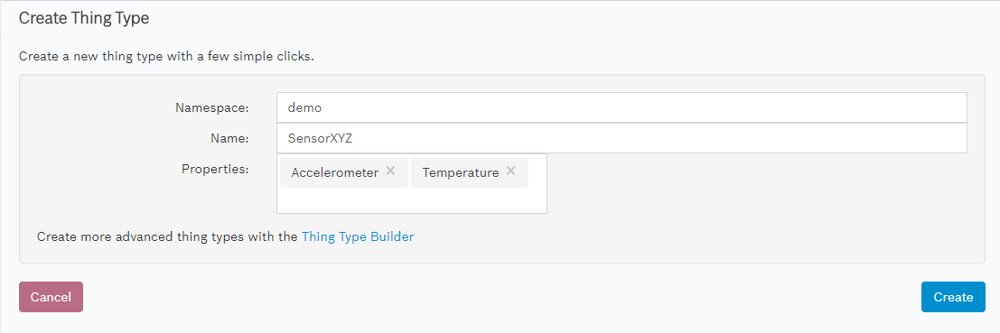
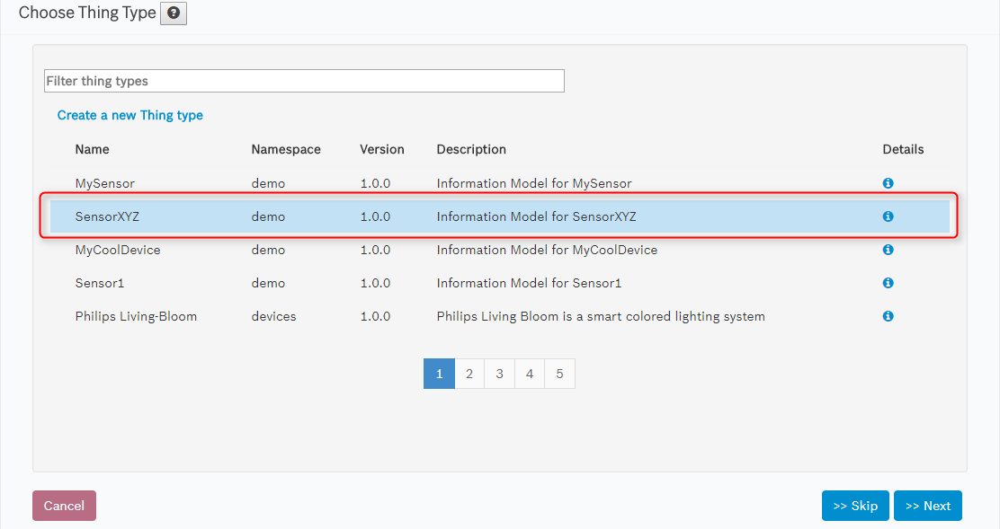
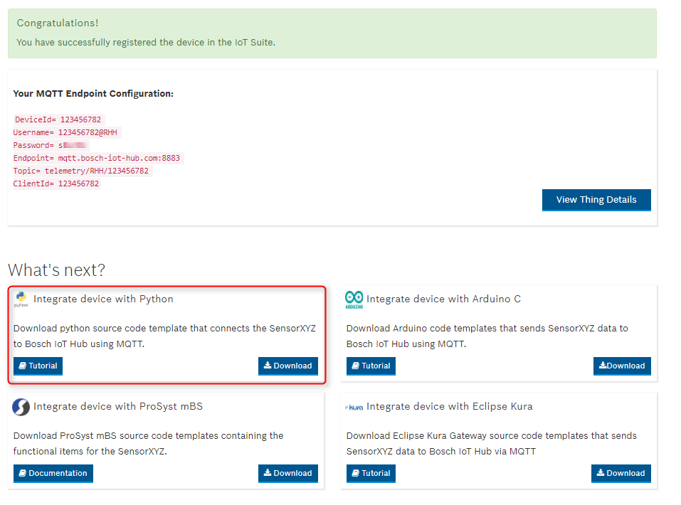

# Getting started with Vorto and the Bosch IoT Suite

Vorto provides a variety of existing Bosch IoT Suite generators, for you to get started very easily. In this guide, we are going to show you:

1. Create a very simple Information Model, describing a few properties of the device and publish the model to the Vorto Repository
2. Register a specific device by creating a new thing in Bosch IoT Things Service
3. Generate a Python Code that sends telemetry device data to the thing in the Bosch IoT Suite via MQTT

## Prerequisite

- [Book](https://www.bosch-iot-suite.com) the following Bosch IoT Suite services :
	- Bosch IoT Hub
	- Bosch IoT Things

## Steps

### 1. Create a simple Information Model for a device

- Open the [Bosch IoT Suite Developer Console](https://console.bosch-iot-suite.com) and log in with your Bosch ID.
- Select **Connect device** in the home screen

- Select **Create a new thing type** in the first wizard page

- Define a 
	- **namespace**, e.g. 'demo'
	- **name** for the thing type, e.g. SensorXYZ
	- Choose the properties **Accelerometer** and **Temperature** from the multi-select box:

- Confirm with **Create** that takes you back to the Thing Type Selections:

### 2. Register device in the Bosch IoT Suite

- Select the thing type from the list and [register](tutorial_register_device.md) the device for your Information Model in the Bosch IoT Suite.
- Choose a **technical device ID** for your device, e.g. the MAC address
- Choose **MQTT** as a connector type and choose a password for device authentication
- Upon registration completion, you should see the following summary page:

### 3. Generate Python Code for MQTT 

- Choose **Integrate device with Python** from the registration summary page and click **Download**
- **Import** the generated source code template into your IDE
- Click [Tutorial](tutorial_connect_device_using_mqtt_python.md) to learn how to configure and run the generated code.

Once you are sending data to the Suite, you can verify the telemetry data in the [Bosch IoT Developer Console](https://console.bosch-iot-suite). For that just browse to the thing you had created in Step 2.

**Congratulations**! With just a single Vorto Information Model, you can connect a device by generating device code templates which send data to the Bosch IoT Suite. 
Feel free to check out the other tutorials from the list of [tutorials](Readme.md) and learn for example, how to generate an AngularJS web application for your information model to consume the device data.
