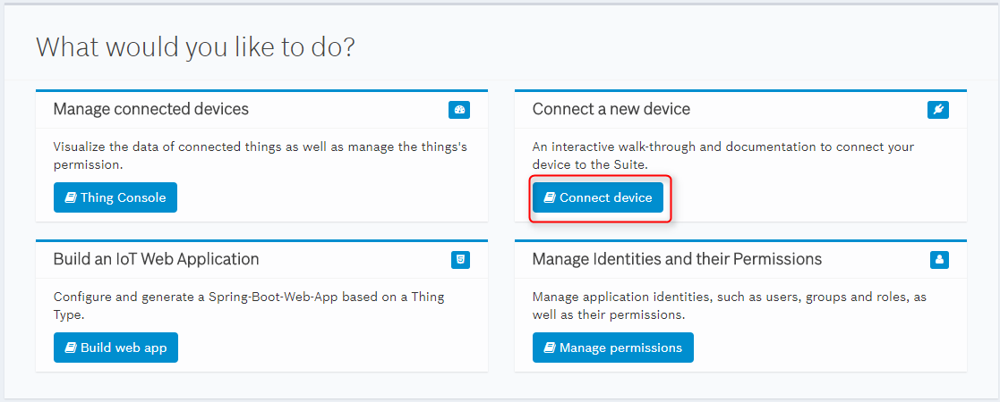
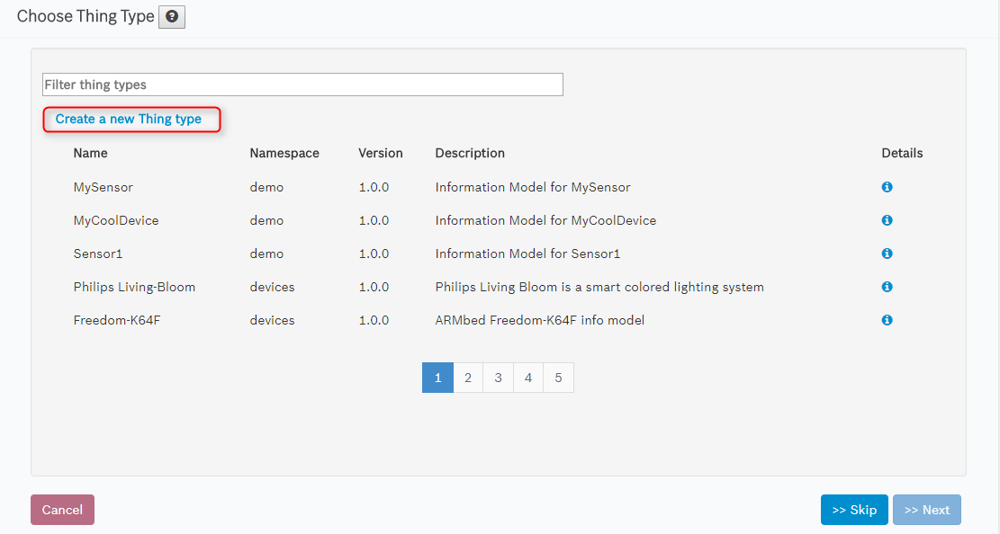
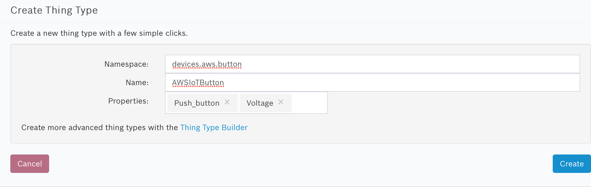

# Map arbitrary device JSON to the Vorto abstraction model

Often times, you are facing the situation that a device sends its data via e.g. MQTT in a very unique format. Then you look into the Vorto Repository and find functionblocks matching the semantics of the device data, but the device data format and the functionblock data format simply do not match.

For example, a device sends voltage information in the following json format:
	
	{"batteryVoltage": "2345mV"}

The Vorto Repository contains a [standard - based IPSO Voltage functionblock](http://vorto.eclipse.org/#/details/com.ipso.smartobjects/Voltage/0.0.1) with the format:

	...
	status {
		mandatory sensor_value as float
		optional sensor_units as string
		...
	}

At this point, you have to options:

1. Create a new functionblock for the Voltage functionality, e.g. MyVoltage and define the format in the way the device sends it , or
2. Re-use a standard - based IPSO functionblock 'Voltage' 

The first option sounds appealing as it would match exactly your required data structure. But this approach comes with a cost: The repository would end up in yet another Voltage functionblock. This would become viral ending up in hundreds of different Voltage functionality flavors for every other voltage capable device, snow-balling the integration efforts for solutions that need to deal with also your specific voltage function block.

The second approach of having only a single voltage functionality would simplify the integration of devices into solutions being able to deal with different devices capable of sending voltage information. This is clearly the preferable option. But how can we we map different device formats to a specific, re-usable function block ? This is the topic we are going to cover in this tutorial.  
	

## Prerequisite

- You have successfully booked the following services:
	- Bosch IoT Things Service
	- Bosch IoT Permissions Service

## Steps

Let's go ahead and integrate the AWS IoT Button as an example to the Bosch IoT Suite.  


### 1. Create an AWS IoT Button Information Model

Let's start by creating an information model for the IoT Button. For that we can use the Developer Console to quickly describe the device's functionality: 

- Open the [Bosch IoT Suite Developer Console](https://console.bosch-iot-suite.com) and log in with your Bosch IoT Permissions credentials.
- Select **Connect device** in the home screen



- Select **Create a new thing type** in the first wizard page



- Define a 
	- **namespace**: devices.aws.button
	- **name**: AWSIoTButton 
	- Choose the properties **Push_Button** and **Voltage** from the multi-select box:



- Confirm with **Create**.

- **That's it**. Click on **Details** to open the information model in the [Vorto Repository](http://vorto.eclipse.org/#/details/devices.aws.button/AWSIoTButton/1.0.0). You can optionally upload an image for the device type there as well.

### 2. Register device in Bosch IoT Suite

- [Follow these instructions](tutorial_register_device.md) in order to register your IoT Button in the Bosch IoT Suite using the Vorto Information Model you had just created.

### 3. Create and Publish a Mapping Specification for the device

At this point, we need to tell the Bosch IoT Suite, how it is supposed to map the actual incoming device payload to the Information Model format. 
	
Mapping Specifications are written as _*.mapping_ files and use XPath expressions that are applied on the source device payload.

For example, the IoT button sends the following JSON payload:
	
	{"clickType" : "DOUBLE", "batteryVoltage": "2322mV"}  

Let's use this info in order to create the mapping specifications for the Vorto Information Model:

- Create a new file, e.g. awsbutton_buttonpayload.mapping and add the following:

```
namespace devices.aws.button
version 1.0.0
displayname "PayloadMapping"
description "Data Mapping model for AWS IoT Button"
using com.ipso.smartobjects.Push_button;0.0.1

functionblockmapping ButtonPayloadMapping {
	targetplatform devices_aws_button_AWSIoTButton_1_0_0
	
	from Push_button to functions with { _namespace: "custom", convertClickType : "function convertClickType(clickType) {if (clickType === 'SINGLE') return 1; else if (clickType === 'DOUBLE') return 2; else return 99;}"}
	from Push_button.status.digital_input_state to source with { value : "true" }
	from Push_button.status.digital_input_count to source with { xpath : "custom:convertClickType(clickType)"}
}
```
- Create another file, e.g. awsbutton_voltagepayload.mapping and add the following:

```
namespace devices.aws.button
version 1.0.0
displayname "PayloadVoltageMapping"
description "Mapping model for PayloadVoltageMapping"

using com.ipso.smartobjects.Voltage;0.0.1

functionblockmapping PayloadVoltageMapping {
	targetplatform devices_aws_button_AWSIoTButton_1_0_0

	from Voltage.status.sensor_value to source with {xpath: "number:toFloat(string:substring(batteryVoltage,0,string:length(batteryVoltage)-2))"}
	from Voltage.status.sensor_units to source with {xpath: "string:substring(batteryVoltage,string:length(batteryVoltage)-2)"}
	from Voltage.status.max_range_value to source with {value: "3000.0"}
}
```
- Log in to the [Vorto Repository](http://vorto.eclipse.org) and Publish these mapping specification files by selecting **Share**.
- Once successfully checked in, you can have a look at the models in the repository:
	- [Button Mapping Specification for AWS IoT Button](http://vorto.eclipse.org/#/details/devices.aws.button/ButtonPayloadMapping/1.0.0)
	- [Voltage Mapping Specification for AWS IoT Button](http://vorto.eclipse.org/#/details/devices.aws.button/PayloadVoltageMapping/1.0.0)
- That's it! 

Looking at the **Button Mapping** specification more closely, have might have spotted some javascript function that is declared as part of the mapping. This is a very powerful way of expressing custom converter functions as javascript that can be used from within your mapping. 

Here we declare the convertClickType function that converts the JSON clickType property value , e.g. 'DOUBLE' to an Integer value. That function is then used by the functionblock property mapping. 

The Vorto Mapping Engine already provides some standard functions that you can use in your mapping specification to do e.g. string manipulations or type conversions. For more info, checkout the [Data Mapping API Documentation](../server/repo/repository-mapping/Readme.md) 

### 4. Send the device data to Bosch IoT Suite

The device can now send data to the Bosch IoT Suite, e.g. via HTTP Connector:

	curl -X PUT -i -H 'Content-Type: application/json' 
	--data-binary '{"clickType" : "DOUBLE", "batteryVoltage": "2322mV"}' 
	https://<hub-endpoint-url>/telemetry/<tenantId>/<deviceId>
	
_Hint_: The deviceId must match the technical device ID, that you had used during the device registration.

### Verify mapped device data in Bosch IoT Things Service

Once the device has sent data, you can check if the data has been successfully mapped and is available in the Bosch IoT Things Service:

1. Via curl:

	```curl -X GET https://things.apps.bosch-iot-cloud.com/api/1/things/<thingId>/features -H "Authorization: Basic <credentialsBase64>" -H "x-cr-api-token: <thingsApiToken>"```

2. Via [Developer Console](https://console.bosch-iot-suite.com)

The mapped JSON output is: 

	{
		"button": { 
			"properties":{ 
				"digital_input_count":2,
				"digital_input_state":true
			}
		},
		"batteryVoltage":{
			"properties":{
				"sensor_units":"mV",
				"sensor_value":2322.0
		 	}
		}
	}

**Great**! Now you know, how you can integrate devices, where you have no control over the devices' JSON payload format but still like to be able to map the data to the Vorto Information Model based abstraction. 

## What's next ? 

- [Build a web application for a device](tutorial_create_webapp_dashboard.md)
- [Build an Amazon Alexa Skillset for a device](tutorial_voicecontrol_alexa.md)
