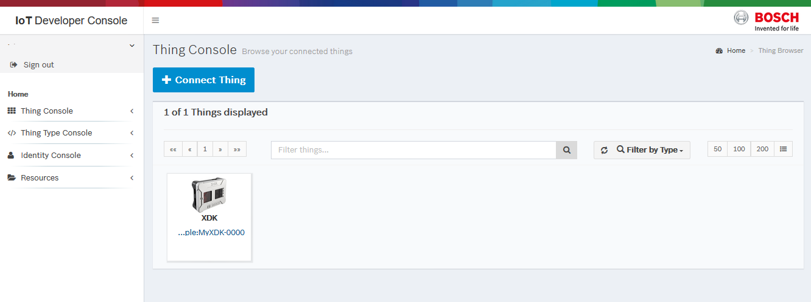

# Register a device in the Bosch IoT Suite

## Prerequisite

- [Publish](tutorial-create_and_publish_with_web_editor.md) an information model for the device to the Vorto Repository.  
* [Book](https://www.bosch-iot-suite.com) the following Bosch IoT Suite services :
	- Bosch IoT Hub
	- Bosch IoT Things

## Steps

- Open the <a href="https://console.bosch-iot-suite.com">Bosch IoT Developer Console</a>
- Log in to the console with your tenant, username and password.
- Open the **Thing Console -> Thing Browser** in the left navigation bar
- Click **Connect thing**

	

- Search the Vorto Repository for the device type you would like to register, e.g. _XDK_. Select the device type and confirm with **Next**

	

- Choose the protocol connector that the device connects to the Suite, e.g. **HTTP**. Confirm your selection with **Next**
- Give your device a unique name. For example
	- **Namespace**: com.mycompany
	- **Name** (Optional) : MyXDK
	- **Technical ID**: For example the mac address of the device, like _FC:D6:BD:10:0B:88_. Confirm your settings with **Complete**
- Now you have successfully registered your device with the Suite for a given Vorto information model and you should be able to see it in the thing browser:
	
	

## What's next ? 

- [Connect a device via MQTT to the Bosch IoT Suite](tutorial_connect_device_using_mqtt_python)

