# A step-by-step guide to setup Vorto Toolset in eclipse IDE for contributors

1. [Setup Eclipse IDE](#setupeclipseIDE)
2. [Execute Vorto from Source Code](#executefromsourcecode)
3. [Start Information model Repository locally](#startinfomodel)
4. [Start the WebEditor locally](#startwebeditor)
5. [Start the Vorto Generators locally](#generators)
6. [Troubleshooting Installation errors](#troubleshoot)

## Step1: Setup Eclipse IDE
1. Download **maven** to local file system
2. Make changes to the _settings.xml_ from _../maven/conf_ > Update the information in _<localRepository>../../</localRepository>_ to a folder in your file system that acts like a _mavenRepo_
3. Download _eclipse Mars(Package : Eclipse IDE for Java and DSL Developers)_.
4. Update _Eclipse Preferences_ by choosing _Window > Preferences_ from the eclipse IDE menu

    a. Set *JDK*: Choose Installed JREs > Ensure that jdk1.8 is selected (if not, select or add jdk1.8)

    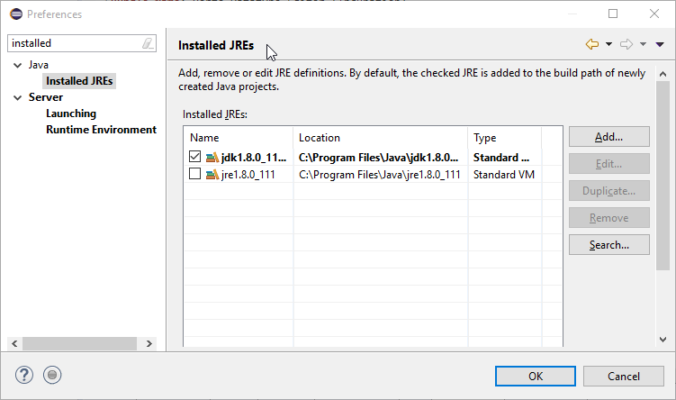

    b.Update **Maven Settings**:

    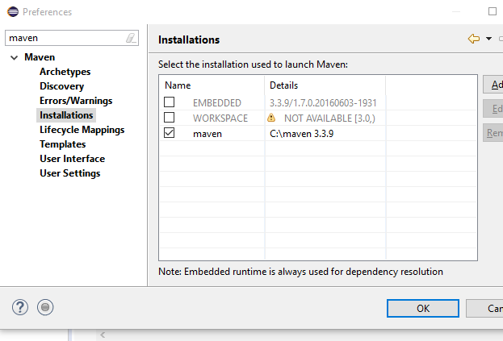

    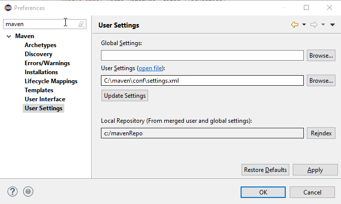

    c. Update **Network Connections**: _(if behind any firewall)_

    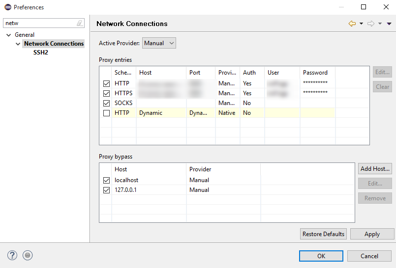

## Step2: Execute Vorto from Source Code

1. Clone the source code from [https://github.com/eclipse/vorto.git] to local file system.
2. Do a Git Switch / Checkout to any relevant branch e.g. development or release or checkout a new branch
3. Launch eclipse IDE, choose import Existing maven projects > Browse to the folder where the Vorto source code files are cloned.
4. Once added, select all the folders from the package explorer > Refresh all
5. Select all > Right-click > Choose Maven - Update project > Select all > OK
6. If there are errors in the console, open command prompt, go to the vorto source code folder > execute _mvn clean install_
7. Open eclipse IDE > Refresh all and Maven Update all. By now all the errors should disappear
8. Right click on _org.editor.vorto.editor.ui > Run as > Eclipse Application_

    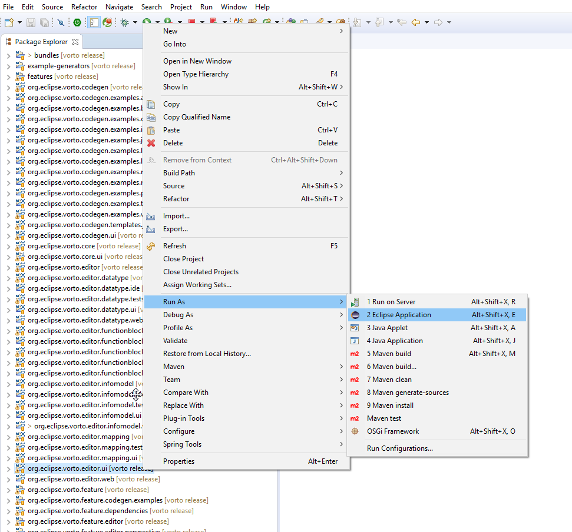
9. A new eclipse instance will be launched > Open Vorto perspective and start using Vorto.

    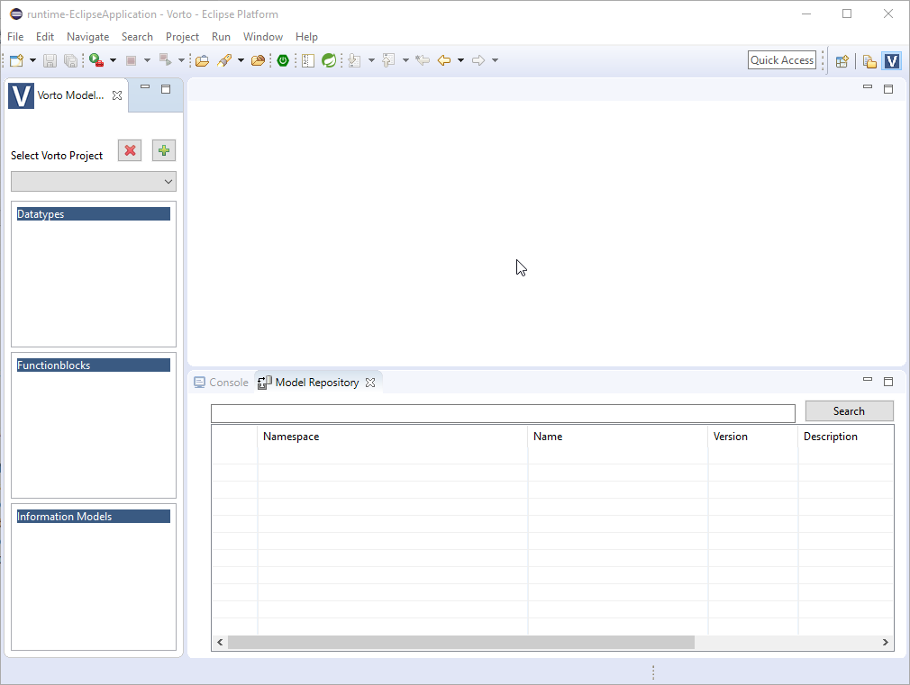

## Step3: Start Information model Repository locally

1. Open command prompt from the repository server folder in the file system  _\vorto\server\repo\repository-server_
2. Run the command _mvn clean install > infomodelrepository.jar_ gets created under _\vorto\server\repo\repository-server\target folder_
3. Log in to your github account and choose _Profile > Settings_

    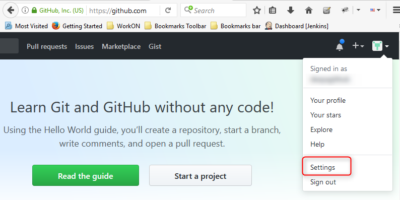

4. Choose _OAuth applications_ and _Register a new application_

    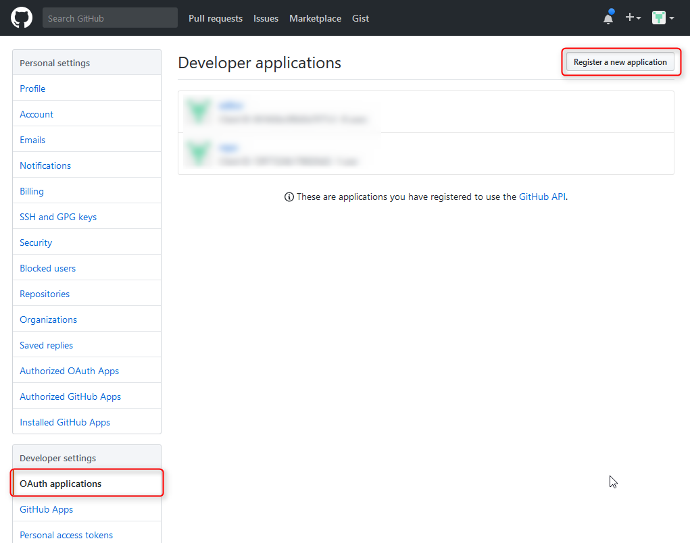

5. Key in details in the _registration form_ and _Register application_

    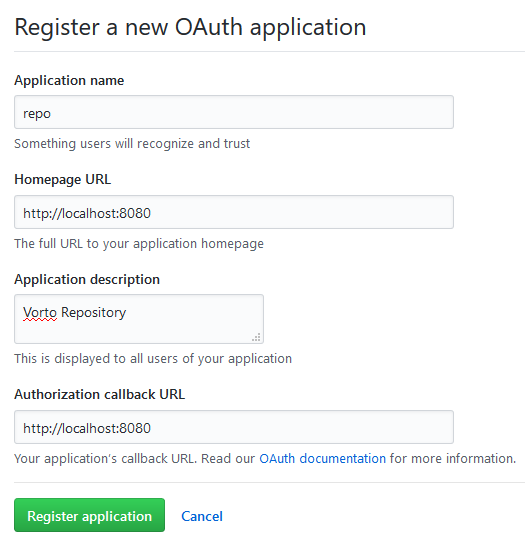

6. _Client ID_ and _Client Secret_ are generated for the registered application
7. Open _eclipse > repo > repository-server > VortoRepository.java > Run as > Run Configuration > Arguments_
8. Specify the following arguements:

        -Dhttp.proxyUser=<PROXY_USERID>
    	-Dhttp.proxyPassword=<PROXY_PASSWORD>
    	-Dhttp.proxyHost=<PROXY>
    	-Dhttp.proxyPort=<PORT>
    	-Dhttps.proxyHost=<PROXY>
    	-Dhttps.proxyPort=<PORT>
    	-Dgithub_clientid=<CLIENT_ID>
    	-Dgithub_secret=<CLIENT_SECRET>

9. Right-Click > _Run as > Java Application_
10. Launch the Vorto Information model repository from localhost:[http://localhost:8080/infomodelrepository/#/]

 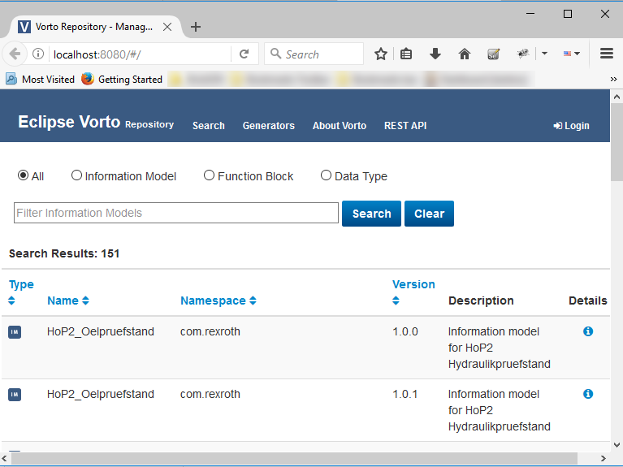

## Step4: Start the WebEditor locally

1. Open command prompt from the webeditor folder in the file system  _\vorto\server\devtool\webeditor_
2. Run the command _mvn clean install_.**webeditor.jar** gets created under _\vorto\server\devtool\webeditor\target_
3. Log in to your github account and choose _Profile > Settings > Choose OAuth applications_ and _Register a new application_
4. Key in details in the registration form and _Register application_

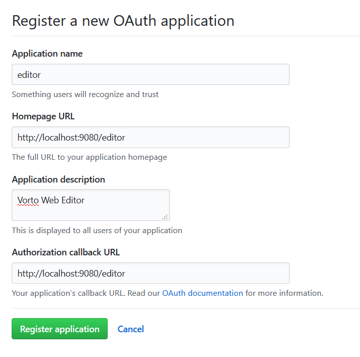

5. _Client ID_ and _Client Secret_ are generated for the registered application
6. From eclipse, choose _webeditor >  src/main/java > org.eclipse.vorto.server.devtool > DevToolServer.java > Right-click > Run As > Run configurations_
7. Choose Arguments tab and key in the following details:

        -DHOME=c:\users\<USERID>
        -Dhttp.proxyUser=<PROXY_USERID>
        -Dhttp.proxyPassword=<PROXY_PASSWORD>
        -Dhttp.proxyHost=<PROXY>
        -Dhttp.proxyPort=<PORT>
        -Dhttps.proxyHost=<PROXY>
        -Dhttps.proxyPort=<PORT>
        -Dgithub_clientid=<CLIENT_ID>
        -Dgithub_secret=<CLIENT_SECRET>

8. _Save > Apply > Run As > Java application >_ The webeditor will be started
9. Launch the Vorto WebEdtitor from localhost:[http://localhost:9080/editor/]

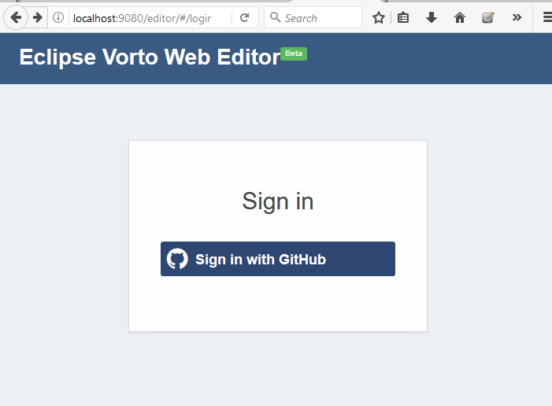

## Step5: Start the Vorto Generators locally

1. Open _eclipse > server> generators>org.eclipse.vorto.codegen.service.gateway>Gateway.java_
2. _Right-Click > Run As > Java Application_
3. Launch the Vorto Generators from localhost:[http://localhost:8080/#/generators]

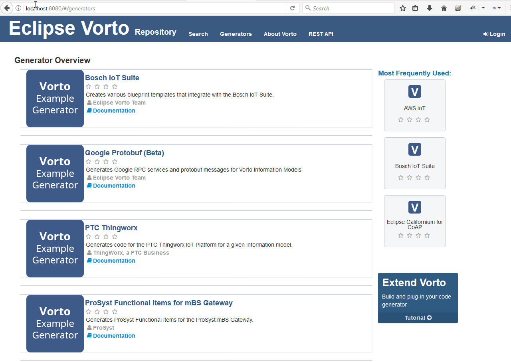

## Troubleshooting Installation errors

The setup should work without any errors in eclipse, if all the above steps are followed. If there are still errors, with respect to target platform, try the following steps:

1. From eclipse IDE, open _Target Definition > i.e. open org.eclipse.vorto.targetplatform > vorto.target_

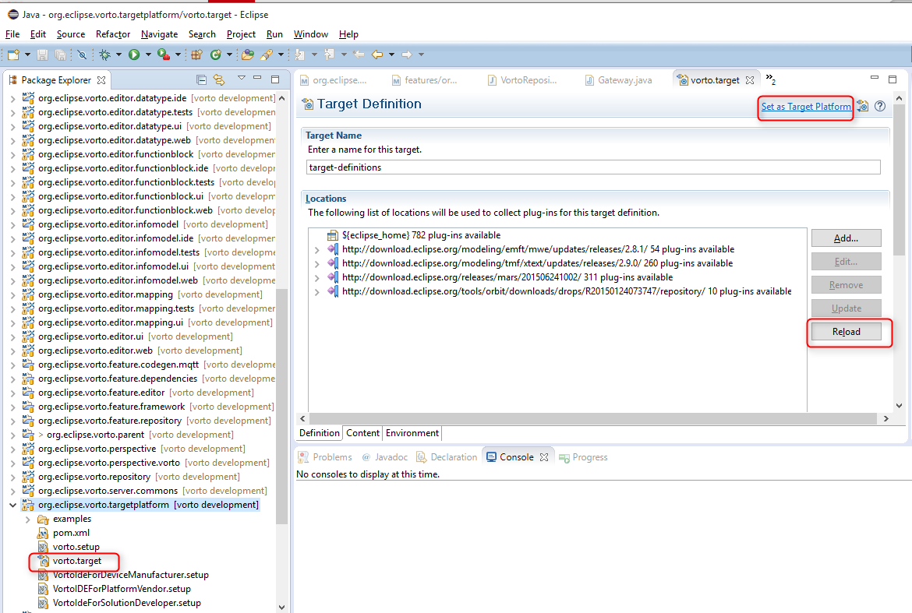

2. Choose > _Reload > Set as Target Platform_

    
